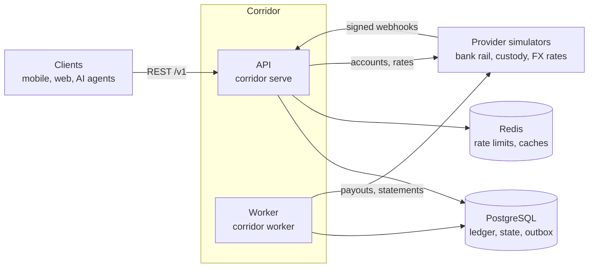

# Corridor

Corridor is the backend of a consumer wallet that holds fiat money and stablecoins side by
side. A user can receive a bank deposit or an on-chain deposit, convert between assets at a
quoted rate, send money to another user, and withdraw to a bank account or a chain
address. A user can also give software, such as an AI agent, a key that spends within
limits the user sets. Underneath is a double-entry ledger: every movement is a balanced
journal entry, history is never edited, and the database itself refuses an entry that does
not balance.

It is one Python codebase (FastAPI, PostgreSQL, Redis) that runs as two processes: an API
and a worker. The bank, the custodian and the FX rate source are simulated by a third
program in this repository, so no real money moves. The point of the project is what
happens around the money: concurrent requests that must not double-spend, retries that
must not pay twice, webhooks that arrive late, twice or never, and a process that can die
between any two steps.

## What it does

| Feature | Where it lives |
|---|---|
| Double-entry ledger: append-only journal, balances that cannot go negative, a verifier that recomputes every invariant | `src/corridor/ledger` |
| Users, Argon2id passwords, ES256 access tokens, rotating refresh tokens, login lockout and throttling | `src/corridor/identity` |
| Wallets per asset (`USD`, `MXN`, `BRL`, `USDC`) with available and held balances and statements | `src/corridor/wallets` |
| Transfers between users, in one database transaction | `src/corridor/payments` |
| Deposits by bank rail and on chain, driven by provider webhooks; returned deposits; suspense for money nobody can be credited with | `src/corridor/payments`, `src/corridor/webhooks` |
| Withdrawals as a saga: hold, submit to the provider, settle or release, with a sweeper for lost answers | `src/corridor/payments` |
| FX quotes and conversions that execute exactly what was quoted | `src/corridor/fx` |
| Limits per KYC tier, user and agent; a deny list; reviews of held movements | `src/corridor/risk` |
| Idempotency keys stored in the same transaction as the money movement | `src/corridor/api/idempotency.py` |
| A transactional outbox, a dispatcher and scheduled jobs | `src/corridor/outbox`, `src/corridor/worker` |
| Reconciliation against provider statements, with automatic repair of lost webhooks | `src/corridor/recon` |
| Agents: scoped API keys, spend policies, approval requests | `src/corridor/agents` |
| Operations: dead letters, review decisions, deposits in suspense, restricting and closing accounts, manual adjustments that need two administrators | `src/corridor/ops` |
| An append-only audit log, which administrators read through the API | `src/corridor/audit` |
| Simulated bank rail, custodian and rate source, with failure injection | `src/corridor_sim` |
| Terraform for AWS (ECS Fargate, RDS, ElastiCache) | `infra` |

## Architecture



PostgreSQL is the only source of truth. The API writes what should happen and an outbox
event in one transaction; the worker calls the provider afterwards and records the result
in a second transaction. No transaction is ever open during a network call.

The documents:

- [docs/architecture.md](docs/architecture.md): the design as built.
- [docs/api.md](docs/api.md): every endpoint with a recorded request and response.
  [docs/openapi.json](docs/openapi.json) is the exported description.
- [docs/runbook.md](docs/runbook.md): what to do when something needs a person.
- [docs/provider-api.md](docs/provider-api.md): the contract with the simulated providers.
- [docs/adr/](docs/adr/README.md): one short record per design decision.
- [infra/README.md](infra/README.md): the AWS deployment.

## Prerequisites

The commands in this README are the same in PowerShell and in a Unix shell unless two forms
are shown.

- [uv](https://docs.astral.sh/uv/) 0.11 or later. It installs Python 3.14 by itself.
- For the Docker quick start: Docker Desktop (or Docker Engine with the Compose plugin).
- For everything else: a PostgreSQL 16 or later and a Redis 7 or later that you can reach.
  The second quick start shows how to run both in Docker.

## Quick start with Docker Compose

`compose.yaml` defines the whole system: PostgreSQL, Redis, a migration run, the API, the
worker and the provider simulators. It builds two images from the one Dockerfile: the
`runtime` target for the API, the worker and the migration, which does not contain the
simulator, and the `sim` target for the simulator.

**This stack has not been started by the automation that wrote this repository.** No
container registry was reachable from where it was built, so the image has never been
built there. The Dockerfile is linted, and `compose.yaml` is verified only by
`docker compose config`. The same three programs are run as plain processes by
`uv run poe e2e`, which does pass. Expect to find a problem on the first run that a
validator could not, and see the notes after the steps.

1. Copy the example settings.

   ```powershell
   Copy-Item .env.example .env
   ```

   In a Unix shell: `cp .env.example .env`.

2. Generate the signing key for access tokens. It is written to `.local/keys`, which git
   and the image build ignore.

   ```powershell
   uv run corridor keys generate --out .local/keys --mode 644
   ```

   `--mode 644` makes the private key readable by other users of this machine. The API
   container runs as user id 10001 and reads the key through a bind mount, which keeps the
   file's permission bits: on a Linux host a key written with the default mode (600, its
   owner alone) could not be read by it. This key is for the local stack only. On Windows
   the option changes nothing and is harmless.

   The command prints two lines. The first names the private key file, for example
   `CORRIDOR_JWT_SIGNING_KEY_FILE=.local/keys/uY40i3DWKUwoK5fQJ2EQM3wah5YAkQQ4wGuDhqYpHss.pem`.
   Open `.env` and set `JWT_SIGNING_KEY_FILE` to the **file name only**:

   ```text
   JWT_SIGNING_KEY_FILE=uY40i3DWKUwoK5fQJ2EQM3wah5YAkQQ4wGuDhqYpHss.pem
   ```

3. Replace every other placeholder in `.env` with a random value. Run this once for each of
   the nine secrets (`POSTGRES_PASSWORD`, `DB_OWNER_PASSWORD`, `DB_APP_PASSWORD`,
   `API_KEY_HASH_KEY`, `FX_CACHE_MAC_KEY`, `PROVIDER_API_KEY`, `BANK_WEBHOOK_SECRET`,
   `CUSTODY_WEBHOOK_SECRET`, `SIM_CONTROL_TOKEN`) and paste the output:

   ```powershell
   uv run python -c "import secrets; print(secrets.token_urlsafe(32))"
   ```

   Each value must be different. In particular the two webhook secrets must differ, or the
   API refuses to start.

4. Build and start the stack. `--wait` returns when every service is healthy.

   ```powershell
   docker compose up --build --wait
   ```

   The API is now at `http://127.0.0.1:8000`, reachable from this machine only. Its
   interactive documentation is at `http://127.0.0.1:8000/docs`.

   The admin endpoints need an administrator, and the first one is made from a shell.
   Register a user through the API, then give that user the role with the one service
   that holds the owner connection:

   ```powershell
   docker compose run --rm migrate corridor users make-admin --email you@example.com --yes
   ```

5. Run the demo. It narrates a deposit, a conversion, a transfer and a withdrawal, then
   verifies the ledger.

   ```powershell
   docker compose --profile demo run --rm demo
   ```

6. Stop the stack. Add `--volumes` to delete the database as well.

   ```powershell
   docker compose down
   ```

Where a first run is most likely to fail, and what to look at:

- **The image build.** `docker compose build` shows the failing step. The build installs
  from `uv.lock` and needs to reach PyPI.
- **The migration run.** `docker compose logs migrate`. It connects as `corridor_owner`,
  which `deploy/postgres-init.sh` creates when the database volume is first initialised. If
  you changed the database passwords after the first start, run
  `docker compose down --volumes` and start again.
- **The API reading the signing key.** `docker compose logs api`. The key directory is
  mounted read-only and the container runs as user id 10001. A key generated without
  `--mode 644` is readable by its owner only, which on a Linux host is not that user:
  generate another as in step 2 and put its name in `.env`. The directories above the key
  must also be ones other users can enter, which is what a usual umask gives.
- **Health checks.** `docker compose ps` shows which service is not healthy.

## Quick start without Docker

This runs the simulator, the API and the worker as ordinary processes on your machine,
against a scratch database that is created for the run and dropped afterwards. This path
is the one the project's own checks use.

1. Install the dependencies exactly as locked.

   ```powershell
   uv sync --frozen
   ```

2. Have a PostgreSQL and a Redis. If you have none, these two commands start throwaway
   ones in Docker. They hold only test data, accept connections from this machine only,
   and the PostgreSQL one takes connections without a password. (These two commands were
   not run by the automation that wrote this repository.)

   ```powershell
   docker run --detach --name corridor-test-postgres --publish 127.0.0.1:5432:5432 --env POSTGRES_HOST_AUTH_METHOD=trust postgres:16 -c max_connections=400 -c fsync=off -c synchronous_commit=off -c full_page_writes=off
   docker run --detach --name corridor-test-redis --publish 127.0.0.1:6379:6379 redis:7
   ```

3. Tell the scripts and the tests where they are. The PostgreSQL URL must be for a role
   that can create databases and roles.

   ```powershell
   $env:CORRIDOR_TEST_POSTGRES_ADMIN_URL = "postgresql://postgres@127.0.0.1:5432/postgres"
   $env:CORRIDOR_TEST_REDIS_URL = "redis://127.0.0.1:6379/0"
   ```

   In a Unix shell:

   ```bash
   export CORRIDOR_TEST_POSTGRES_ADMIN_URL="postgresql://postgres@127.0.0.1:5432/postgres"
   export CORRIDOR_TEST_REDIS_URL="redis://127.0.0.1:6379/0"
   ```

4. Run the end-to-end scenario. It starts the three processes, loses a deposit webhook on
   purpose and lets reconciliation repair it, moves money through every flow, has an agent
   ask for approval, and ends by verifying the ledger.

   ```powershell
   uv run poe e2e
   ```

   The last lines of a passing run:

   ```text
     ok    Ana approves, and the 30.00 USD moves
     ok    approving a second time moves nothing more
   Ledger verification passed: no findings.
     ok    corridor verify-ledger exits 0
   End-to-end run passed.
   ```

5. Run the demo. It starts the same stack and tells the story step by step.

   ```powershell
   uv run poe demo
   ```

   ```text
   1. Two people open accounts.
         Ana is @ana_bb581991 and Bruno is @bruno_29380020.
         Ana Lima has nothing yet.
         Bruno Costa has nothing yet.
   2. Ana asks where to send US dollars, and her bank sends 500.00 USD there.
         Corridor gave her an account on the ACH rail.
         The bank tells Corridor by webhook, and the worker credits her wallet.
         Ana Lima has 500.00 USD.
         Bruno Costa has nothing yet.
   3. Ana converts 100.00 USD into Mexican pesos at a quoted rate.
         The quote: 100.00 USD buys 1715.77 MXN.
         Ana Lima has 1715.77 MXN, 400.00 USD.
         Bruno Costa has nothing yet.
   4. Ana sends Bruno 50.00 USD. It arrives at once: both are Corridor users.
         The fee was 0.00 USD.
         Ana Lima has 1715.77 MXN, 350.00 USD.
         Bruno Costa has 50.00 USD.
   5. Bruno saves his bank account and withdraws 40.00 USD to it.
         Corridor holds 40.00 USD and a fee of 0.25 USD while the bank pays out.
         Ana Lima has 1715.77 MXN, 350.00 USD.
         Bruno Costa has 9.75 USD (and 40.25 USD on hold).
         The bank says the payout settled, and the hold becomes a payment.
         Ana Lima has 1715.77 MXN, 350.00 USD.
         Bruno Costa has 9.75 USD.
   6. Every balance is recomputed from the ledger's postings.
   Ledger verification passed: no findings.
   ```

Both outputs above were copied from real runs on Linux. The scripts have not been run on
Windows by the automation that wrote this repository; they use only `python -m` and no
Unix-only feature.

## Commands

| Command | What it does |
|---|---|
| `uv sync --frozen` | Install exactly what the lockfile says |
| `uv run poe check` | Every gate, in order: lint, type check, module boundaries, the test suite with coverage, the coverage thresholds |
| `uv run poe lint` | `ruff check` and `ruff format --check` |
| `uv run poe format` | Apply lint fixes and formatting |
| `uv run poe typecheck` | `mypy --strict` over `src` |
| `uv run poe contracts` | Module boundaries (`import-linter`) |
| `uv run poe test` | The test suite. `uv run pytest tests/ledger -q` runs one directory |
| `uv run poe test-cov`, `uv run poe coverage` | The suite with coverage recorded; then the thresholds (94% overall, 96% on the money modules) |
| `uv run poe smoke` | Start the API as a real process and probe it |
| `uv run poe e2e` | Start API, worker and simulators as real processes and drive a scenario through them |
| `uv run poe demo` | Start the same stack and narrate a deposit, a conversion, a transfer and a withdrawal |
| `uv run poe audit` | Check the installed dependencies for known vulnerabilities |
| `uv run poe lint-docs` | Check the documentation: links, diagrams, `docs/openapi.json` against the code |
| `uv run poe lint-docker` | Lint the Dockerfile (Linux and macOS) |
| `uv run poe lint-compose` | Validate `compose.yaml` with the placeholder settings (needs the Docker command line with the Compose plugin; no daemon) |
| `uv run poe lint-ci` | Lint the GitHub workflows |
| `uv run poe lint-infra` | Check the Terraform (needs Terraform) |
| `uv run corridor serve` | Run the API. Needs `CORRIDOR_DATABASE_URL`, `CORRIDOR_REDIS_URL` and a signing key |
| `uv run corridor worker` | Run the worker |
| `uv run corridor db migrate` | Apply migrations. Needs `CORRIDOR_DATABASE_OWNER_URL` |
| `uv run corridor keys generate --out DIRECTORY` | Generate a signing key pair. `--mode 644` writes a private key that another user, such as a container's, can read |
| `uv run corridor users make-admin --email ADDRESS --yes` | Make a registered user an administrator. Needs `CORRIDOR_DATABASE_OWNER_URL`. Without `--yes` it changes nothing |
| `uv run corridor verify-ledger` | Recompute the ledger's invariants, and that every held and suspense balance is accounted for by a withdrawal or a deposit. Exits 1 on any finding |
| `uv run corridor demo` | Run the demo against a stack that is already running |

`poe test`, `check`, `smoke`, `e2e` and `demo` need the two `CORRIDOR_TEST_` variables from
the quick start. The full suite takes roughly a quarter of an hour. Every setting of the application is
listed in [the architecture](docs/architecture.md#settings).

## How it is tested

The tests run against a real PostgreSQL and a real Redis, because the guarantees under test
(row locks, `SKIP LOCKED`, deferred triggers, constraints, grants) live in the database and
cannot be mocked. Each test gets its own database, cloned from a migrated template, and its
own Redis key prefix. When a test that touched the database ends, the ledger verifier runs
and fails the test on any finding. Every guard on a money path was proved by mutation: the
check was removed and a test had to fail. A failure-injection suite (`tests/chaos`) runs
withdrawals and deposits against the simulator while it times out, fails after doing the
work, duplicates, reorders and drops webhooks, and while the worker is killed at each step;
it requires exactly one provider payout per withdrawal and one credit per deposit.
Concurrency tests run 200 debits against a balance that affords 50 and expect exactly 50.
Property-based tests generate sequences of operations and require the ledger to stay
balanced. `uv run poe e2e` then proves the installed programs find each other over real
sockets.

## Repository layout

```text
src/corridor/        the application: one directory per module, plus cli.py and demo.py
src/corridor_sim/    the provider simulators, a separate application
migrations/          hand-written Alembic revisions
tests/               one directory per module, plus chaos, security, assembly, e2e, harness,
                     simulators and the shared support code
scripts/             smoke.py, e2e.py, lint_docs.py
docs/                architecture, API guide, runbook, provider contract, decision records
infra/               Terraform for AWS
deploy/              the database init script the compose stack uses
compose.yaml         the local stack
Dockerfile           one image for the API, the worker and the migration run (`runtime`),
                     and one for the simulators (`sim`)
.github/workflows/   CI and the manual deploy workflow
CLAUDE.md            the rules and conventions for working in this repository
```

## What this is not

- **Not connected to any real provider.** The bank rail, the custodian and the rate source
  are simulators in this repository. The adapters have never talked to a real bank.
- **No real money and no real people.** Every name, account number, address and balance is
  synthetic. Do not load real personal or financial data into it.
- **Not security-audited.** The controls are described in the architecture and tested, and
  nobody independent has reviewed them. There is no MFA, no email verification and no
  device binding.
- **Not a compliance system.** KYC tiers, screening and limits are stubs with the right
  shape and no real rules behind them.
- **Not deployed.** The container image has not been built, the compose stack has not been
  started, the Terraform has not been applied and the CI workflows have not run. Each is
  checked statically. There is no load test.

The full list is in [the architecture](docs/architecture.md#22-known-limits-of-this-build).

## Licence

MIT. See [LICENSE](LICENSE).
