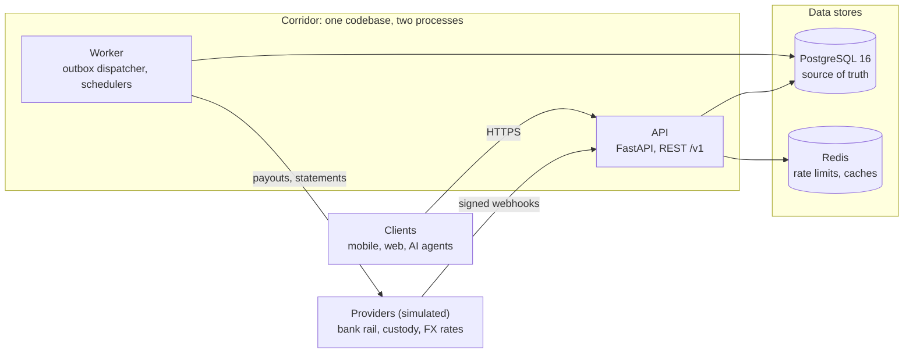
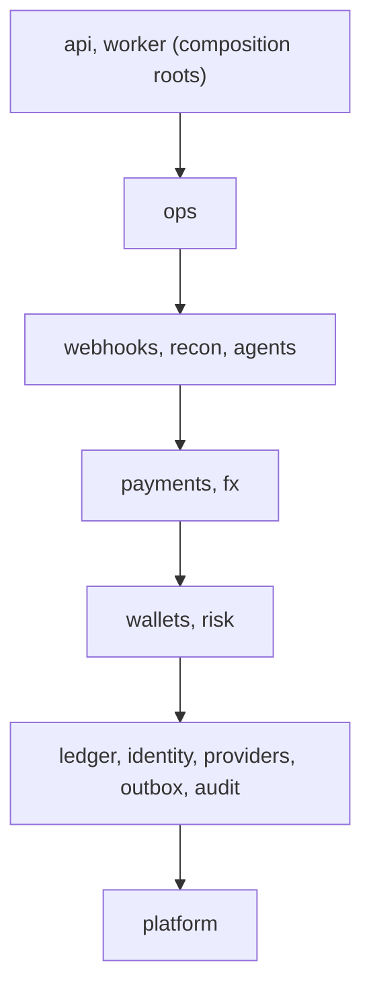
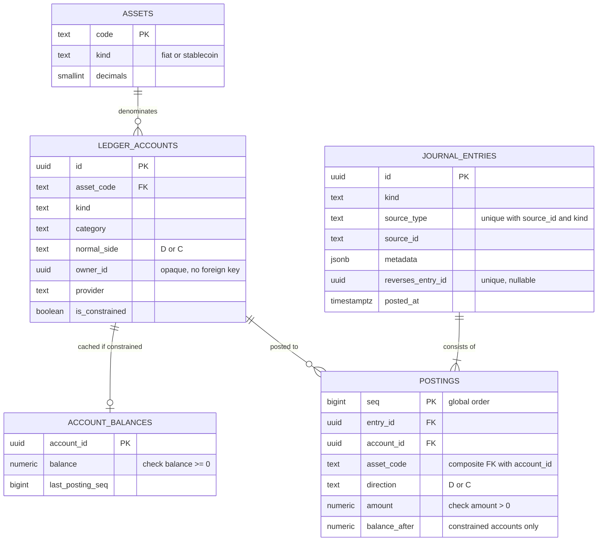
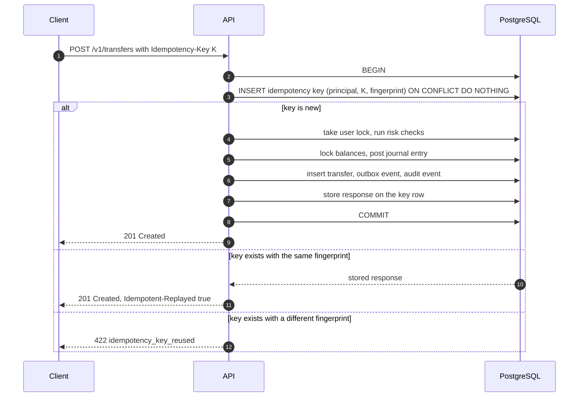
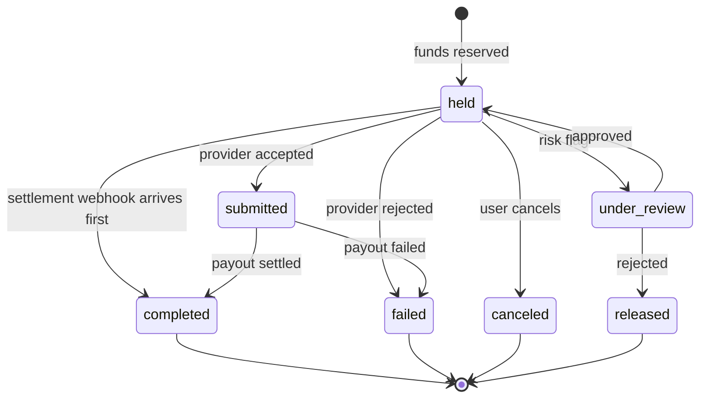
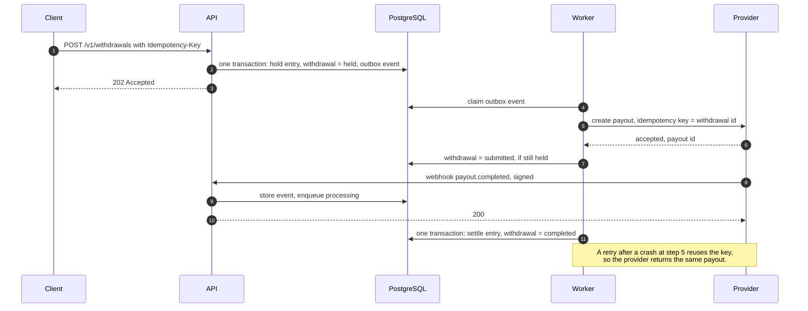
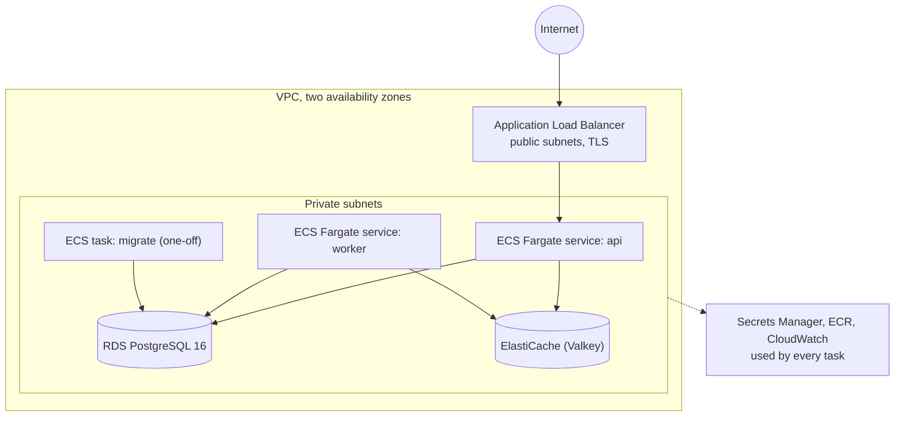

# Corridor — architecture

| | |
|---|---|
| **Status** | Proposed design, pre-implementation (v0.1) |
| **Date** | 2026-10-05 |
| **Scope** | Backend only: REST API, worker, data model, provider integrations, deployment |

Corridor is the backend for a consumer wallet that holds fiat and stablecoin balances side by
side. It serves a REST API to mobile, web and AI-agent clients, integrates with bank-rail and
crypto-custody providers, and keeps its own double-entry ledger. It is one Python codebase
(a modular monolith) that runs as two processes, with PostgreSQL as the system of record,
Redis for ephemeral state, and AWS as the deployment target.

The providers are simulated inside this repository, so no real money moves. Everything on
Corridor's side of that boundary is built the way a production system would be.

## Contents

1. [Goals](#1-goals)
2. [System overview](#2-system-overview)
3. [Module map](#3-module-map)
4. [Money and the ledger](#4-money-and-the-ledger)
5. [Concurrency and transactions](#5-concurrency-and-transactions)
6. [Idempotency](#6-idempotency)
7. [Asynchronous work](#7-asynchronous-work)
8. [Money flows](#8-money-flows)
9. [Risk, compliance and audit](#9-risk-compliance-and-audit)
10. [Reconciliation](#10-reconciliation)
11. [Agents: delegated spending](#11-agents-delegated-spending)
12. [API design](#12-api-design)
13. [Security](#13-security)
14. [Data stores](#14-data-stores)
15. [Observability](#15-observability)
16. [Testing strategy](#16-testing-strategy)
17. [Local development](#17-local-development)
18. [AWS deployment](#18-aws-deployment)
19. [Stack](#19-stack)
20. [Decision log](#20-decision-log)
21. [How this scales and where it splits](#21-how-this-scales-and-where-it-splits)
22. [Known limits of this build](#22-known-limits-of-this-build)

---

## 1. Goals

### Design goals, in priority order

1. **Money is conserved.** Every movement is a balanced double-entry journal entry. History is
   append-only. The database refuses an unbalanced or edited entry even if the application
   has a bug.
2. **No double spend.** Concurrent requests against the same balance cannot both succeed when
   only one can be afforded.
3. **Retries are safe.** A client retry, a worker retry or a duplicate webhook produces the
   effect once.
4. **Every crash point converges.** If a process dies between any two steps, the system
   reaches a correct state without manual repair: by retry, by a sweeper, or by reconciliation.
5. **Boundaries are enforced, not agreed.** Module boundaries are checked in CI, so the
   monolith can be split later along lines that already exist.
6. **It is operable.** Structured logs, metrics, health checks, rate limits, least-privilege
   database roles, and a one-command local stack.

### Non-goals

Real money, real identity verification, real key custody, a frontend, cards, lending, yield,
multi-region deployment, and treasury or hedging of the FX position. Section 21 says how
several of these would be approached.

### Success criteria

The build is done when each of these is observed, not assumed.

| # | Criterion | How it is checked |
|---|---|---|
| S1 | The ledger holds its invariants after every test run, including the concurrency and failure-injection suites | `corridor verify-ledger` reports zero violations |
| S2 | 200 concurrent debits against a balance that affords 50 result in exactly 50 successes and no negative balance | concurrency test |
| S3 | 50 concurrent identical requests with one idempotency key produce one effect and 50 identical responses; the same key with a different body is rejected | idempotency tests |
| S4 | For every withdrawal, the provider records exactly one payout under injected crashes, timeouts, duplicate webhooks and out-of-order webhooks | failure-injection tests against the simulator |
| S5 | Reconciliation repairs a dropped deposit webhook and reports an amount mismatch | reconciliation tests |
| S6 | Lint, strict type check, module-boundary contracts, dependency audit and secret scan are clean | `uv run poe check` |
| S7 | API, worker and simulators run as real processes and a scripted end-to-end scenario passes | `uv run poe e2e` |
| S8 | Line coverage is at least 90% on `ledger`, `payments` and `fx`, and at least 80% overall | coverage gate in `poe check` |

---

## 2. System overview



| Component | Responsibility | State it owns | Scales by |
|---|---|---|---|
| **API** | Authenticates callers, validates input, runs each synchronous operation in one database transaction, accepts webhooks | None (stateless) | Adding tasks behind the load balancer |
| **Worker** | Drains the outbox, calls providers, processes stored webhooks, runs scheduled jobs (payout sweeper, reconciliation, ledger verifier, key cleanup) | None (stateless) | Adding tasks; work is claimed with `SKIP LOCKED`, scheduled jobs take an advisory lock |
| **PostgreSQL** | The only source of truth: ledger, business state, outbox, idempotency keys, audit log | Everything durable | Vertically first; see section 21 |
| **Redis** | Rate limiting, FX rate cache, session revocation hints | Nothing that cannot be rebuilt | Not a bottleneck at this scale |
| **Simulators** | Stand in for a bank-rail provider, a custody provider and an FX rate source, with failure injection | Their own in-memory books | Test infrastructure only |

Two rules shape everything else:

- **PostgreSQL is the only source of truth.** Redis can be flushed at any moment without
  losing or corrupting money. Each Redis use has a documented behaviour for when Redis is
  unavailable (section 14).
- **A database transaction never spans a network call.** The API commits intent; the worker
  performs the external call; the result is committed in a second transaction.

---

## 3. Module map

```text
src/corridor/
  platform/     config, database session, redis, logging, errors, ids, money, clock, middleware
  identity/     users, passwords, tokens, principals, KYC tier
  ledger/       accounts, journal entries, postings, balances; the only writer of ledger tables
  providers/    ports (Protocols) and HTTP adapters: bank rail, custody, FX rates
  outbox/       outbox table, dispatcher, handler registry, retry policy
  audit/        append-only audit log
  wallets/      a user's accounts per asset, balances, statements
  risk/         limits, spend records, screening
  payments/     transfers, deposits, withdrawals: state machines and orchestration
  fx/           quotes and conversions
  webhooks/     inbound provider webhooks: verify, de-duplicate, enqueue
  agents/       agent principals, API keys, spend policies, approval requests
  recon/        reconciliation runs and breaks
  ops/          admin API: dead letters, reconciliation, adjustments with dual approval
  api/          app factory, routers, auth and idempotency dependencies, error handlers
  worker/       worker entry point: outbox loop and schedulers
  cli.py        serve, worker, migrate, seed, verify-ledger, keys, demo
src/corridor_sim/  separate FastAPI app: bank rail, custody and FX simulators
migrations/     Alembic revisions
infra/          AWS infrastructure as code
tests/
```



A module may import only from layers below it, and modules in the same layer do not import
each other. Three rules make the boundaries real:

1. **Tables are private.** Only the owning module's code touches its tables. Other modules
   call its service functions. There are no foreign keys from `ledger` to any other module:
   a ledger account refers to its owner by an opaque id.
2. **Entry points own the transaction.** An HTTP handler, an outbox handler or a scheduled job
   opens one transaction and passes the session down explicitly. No module opens a hidden
   transaction of its own, so it is always clear what commits together.
3. **CI enforces it.** `import-linter` contracts encode the layers and forbid importing
   another module's `models` or `repo`. A boundary violation fails the build.

| Module | Owns tables | What other modules may ask of it |
|---|---|---|
| `ledger` | `assets`, `ledger_accounts`, `account_balances`, `journal_entries`, `postings` | open an account, post an entry, read balances and postings, verify |
| `identity` | `users`, `refresh_tokens` | authenticate, resolve a principal, look up a user |
| `providers` | none | bank rail, custody and rate-source clients |
| `outbox` | `outbox_events` | enqueue an event inside the caller's transaction; register a handler |
| `audit` | `audit_events` | record an audit event inside the caller's transaction |
| `wallets` | `wallet_accounts` | provision a user's accounts, resolve account ids, list statements |
| `risk` | `limit_rules`, `spend_records` | authorize a money movement, record spend, screen a party or address |
| `payments` | `transfers`, `deposits`, `deposit_instructions`, `withdrawals`, `beneficiaries` | create and advance transfers, deposits and withdrawals |
| `fx` | `fx_quotes`, `fx_conversions` | quote and convert |
| `agents` | `agents`, `api_keys`, `approval_requests` | authenticate an API key, manage policies, execute an approved request through `payments` |
| `webhooks` | `webhook_events` | none; it is an entry point |
| `recon` | `recon_runs`, `recon_breaks` | run a reconciliation, list breaks |
| `ops` | `adjustment_requests` | none; it is an entry point |
| `api` | `idempotency_keys` | none; it is an entry point |

---

## 4. Money and the ledger

### 4.1 Representing money

- An amount is an **integer count of the asset's smallest unit**. There is no floating point
  anywhere in the money path.
- The column type is `NUMERIC(38,0)`, mapped to Python `int`. `BIGINT` would overflow at
  about 9.2 units of an 18-decimal token, and a wallet that holds stablecoins across chains
  cannot assume six decimals.
- Each asset records its `decimals`. Initial assets: `USD` (2), `MXN` (2), `BRL` (2),
  `USDC` (6).
- The API carries amounts as **decimal strings in major units** (`"12.34"`), validated
  against the asset's scale. JSON numbers lose precision above 2^53 in JavaScript clients.
- Rounding happens in exactly one place, FX quoting, and always rounds the customer's
  receive amount down.

### 4.2 Chart of accounts

Balances are tracked from the operator's point of view: what customers hold is a liability,
and what sits at a bank or custodian is an asset.

| Account kind | Category | Normal side | One per | May go negative | Meaning |
|---|---|---|---|---|---|
| `user_available` | liability | credit | user and asset | **no** | Spendable balance |
| `user_held` | liability | credit | user and asset | **no** | Reserved for in-flight withdrawals |
| `user_receivable` | asset | debit | user and asset | no | What a user owes after a returned deposit |
| `bank_settlement` | asset | debit | provider and fiat asset | yes | Cash at the bank partner |
| `custody_omnibus` | asset | debit | provider and stablecoin | yes | Tokens at the custodian |
| `suspense` | liability | credit | asset | yes | Funds received but not yet attributable or under review |
| `fx_position` | asset | debit | asset | yes | The operator's FX exposure |
| `fee_revenue` | revenue | credit | asset | yes | Fees earned |
| `provider_fee_expense` | expense | debit | asset | yes | Network and payout fees paid to providers |

Accounts that may not go negative are called **constrained**. The distinction drives the
locking design in section 4.6.

### 4.3 Tables



A posting carries an explicit direction and a positive amount, which reads the way
accountants read a ledger. An account's balance is the sum of postings on its normal side
minus the sum on the other side.

### 4.4 Entry catalogue

Every movement in the system is one of these entries. `a` is the amount, `f` Corridor's fee,
`p` the provider's fee. `D` is a debit and `C` a credit.

| Movement | Postings |
|---|---|
| Fiat deposit | D `bank_settlement` a · C `user_available` a |
| Stablecoin deposit | D `custody_omnibus` a · C `user_available` a |
| Deposit held for review | D settlement or omnibus a · C `suspense` a |
| Review release | D `suspense` a · C `user_available` a |
| Returned deposit | D `user_available` min(a, available) · D `user_receivable` shortfall · C `bank_settlement` a |
| Transfer between users | D sender `user_available` a+f · C recipient `user_available` a · C `fee_revenue` f |
| Withdrawal hold | D `user_available` a+f · C `user_held` a+f |
| Withdrawal settle | D `user_held` a+f · D `provider_fee_expense` p · C settlement or omnibus a+p · C `fee_revenue` f |
| Withdrawal release | D `user_held` a+f · C `user_available` a+f |
| Conversion, sell leg (asset S) | D `user_available` s · C `fx_position` s |
| Conversion, buy leg (asset B) | D `fx_position` b · C `user_available` b |
| Reversal | The original entry with D and C swapped, linked by `reverses_entry_id` |
| Adjustment | Any balanced postings, requested by one admin and approved by another |

A conversion is one entry that balances in each asset separately. Zero-amount postings are
omitted, so a fee-free transfer has two postings.

### 4.5 Invariants and where each is enforced

Each invariant has three layers: the application refuses to create a violation, the database
refuses to store one, and a verifier detects one after the fact.

| Invariant | Application | Database | Verifier |
|---|---|---|---|
| Debits equal credits per asset in every entry | `post_entry` rejects an unbalanced draft | Deferred constraint trigger checks the entry at commit | Recomputes for every entry |
| An entry has at least two postings | `post_entry` | Deferred constraint trigger on `journal_entries` | Flags empty entries |
| Entries and postings are never edited or deleted | No update or delete code exists | `BEFORE UPDATE OR DELETE` and `TRUNCATE` triggers raise; the application role has no `UPDATE` or `DELETE` grant on these tables | n/a |
| A posting's asset matches its account's asset | Account lookup | Composite foreign key `(account_id, asset_code)` | n/a |
| A constrained account never goes below zero | Balance check under lock | `CHECK (balance >= 0)` | Flags negative balances |
| A cached balance equals the sum of its postings | One code path updates both | n/a | Recomputes and compares |
| One business event posts at most once | `post_entry` returns the existing entry | `UNIQUE (source_type, source_id, kind)` | n/a |
| An entry is reversed at most once | Reversal lookup | `UNIQUE (reverses_entry_id)` | n/a |

Corrections are new entries. Nothing in the ledger is ever changed.

### 4.6 Balances: cached where constrained, derived elsewhere

A balance check has to be atomic with the debit, which means a row lock. Locking is cheap on
a user's own account and expensive on an account every transaction touches: if `fee_revenue`
had a locked balance row, every fee-bearing transfer in the system would queue behind it.

- **Constrained accounts** (`user_available`, `user_held`, `user_receivable`) have a row in
  `account_balances`. Posting locks that row, checks the result, and updates it. Contention
  is per user.
- **Unconstrained accounts** (settlement, omnibus, suspense, FX position, revenue, expense)
  have no cached balance and take no lock. Postings are appended and the balance is computed
  from them on read.

This removes the hot-account bottleneck by design rather than by tuning. At larger volume the
derived balances would be served from periodic snapshots plus the postings since the
snapshot; section 21 covers that.

### 4.7 Posting algorithm

`ledger.post_entry(session, draft)` runs inside the caller's transaction. Every check comes
before the first write, so a refused entry has written nothing and the caller's transaction
stays usable:

1. Validate the draft: at least two postings, positive amounts, each account named once,
   every account exists, debits equal credits per asset.
2. Lock the `account_balances` rows of the constrained accounts involved, **in ascending
   account id order**.
3. If an entry with the same `(source_type, source_id, kind)` exists, return it. If its
   postings differ from the draft, raise `ConflictingEntry`. This comes after the locks
   because a concurrent transaction posting the same event holds the same locks, and before
   the funds check because a replay must be recognised even if the balance has since been
   spent.
4. Compute the new balances. If any would be negative, raise `InsufficientFunds`.
5. Insert the entry with `ON CONFLICT DO NOTHING`. If a concurrent transaction that shares
   no constrained account inserted the same source first, return that entry.
6. Insert the postings in one statement, with `balance_after` for constrained accounts.
7. Update the locked balance rows.

---

## 5. Concurrency and transactions

**Isolation.** `READ COMMITTED` with explicit locks. The alternatives were considered:

| Option | Why not |
|---|---|
| `SERIALIZABLE` everywhere | Every use case needs a retry loop, and busy accounts produce a steady rate of aborts. Explicit locks state exactly what is being protected. |
| Optimistic versioning (compare-and-swap on a version column) | Works, but turns contention into retries, and retries are exactly what a busy balance cannot afford. A short row lock queues instead. |
| `CHECK` constraint as the only guard | A violated constraint aborts the whole transaction, so the outcome could not be recorded for an idempotent replay. The constraint stays as a backstop. |

**Lock order.** Deadlocks are prevented by always taking locks in this order:

1. The idempotency key (unique index insert).
2. Per-user money-out advisory locks, ascending by user id.
3. The business row being advanced (`SELECT … FOR UPDATE` on a withdrawal, deposit or quote).
4. Balance rows, ascending by account id.

**Why a per-user lock.** Daily limits are across all of a user's assets, but balance rows are
per asset. Two concurrent sends in different assets would each read the same day-to-date
total and both pass. A transaction-scoped advisory lock keyed on the user serialises that
user's outgoing operations, which makes the limit check and the balance check race-free
without serialising anyone else.

**Transaction hygiene.**

- One transaction per unit of work; no transaction is open during a network call.
- `lock_timeout` 5s, `statement_timeout` 10s, `idle_in_transaction_session_timeout` 15s, set
  per connection. The session time zone is pinned to UTC.
- Deadlock (`40P01`) and serialisation (`40001`) errors are retried up to three times at the
  unit-of-work boundary. With the lock order above they should not occur; the retry is a
  seatbelt, and a metric counts every use of it.

---

## 6. Idempotency

Every request that creates a money movement must carry an `Idempotency-Key` header. The
status codes follow the IETF draft for that header, and the store-and-replay behaviour is the
one Stripe documents for its API.

**The key and the effect commit in the same transaction.** That is the whole design:



- **Scope.** A key is unique per principal. The fingerprint is a SHA-256 over the method, the
  route template and the canonical JSON body.
- **Concurrent duplicates.** The second `INSERT` blocks on the unique index until the first
  transaction finishes, then sees the committed row and replays its response. If the wait
  exceeds `lock_timeout`, the client gets `409 request_in_progress` with `Retry-After`.
- **What is stored.** The status code and body of the first completed attempt, including
  domain failures such as insufficient funds. A key identifies one attempt, so retrying a
  declined request with the same key returns the same decline.
- **What is not stored.** Authentication failures and malformed requests, which are rejected
  before the key is read, and unexpected errors, where the transaction rolls back and takes
  the key with it. The client can safely retry those.
- **Lifetime.** Keys are deleted after 24 hours by a scheduled job.

**Why PostgreSQL and not Redis.** A key held in Redis cannot commit atomically with a ledger
entry in PostgreSQL. Every ordering of the two writes leaves a window where a crash produces
either a double spend or a stuck key. Keeping the key next to the effect removes the window.

There is a second, independent layer underneath: the ledger's `UNIQUE (source_type,
source_id, kind)` means a business event cannot post twice even if a handler runs twice.

---

## 7. Asynchronous work

### 7.1 Transactional outbox

Anything that must happen after a commit (calling a provider, processing a webhook, sending a
notification) is written as a row in `outbox_events` **in the same transaction** as the state
change that causes it. The event exists if and only if the state change committed.

The worker claims events in a short transaction:

```sql
UPDATE outbox_events
   SET status = 'processing', attempts = attempts + 1,
       locked_until = now() + interval '60 seconds'
 WHERE id IN (
         SELECT id FROM outbox_events
          WHERE (status = 'pending' AND available_at <= now())
             OR (status = 'processing' AND locked_until < now())
          ORDER BY id
          FOR UPDATE SKIP LOCKED
          LIMIT :batch)
RETURNING *;
```

- **At-least-once delivery.** A handler may run more than once, so every handler is
  idempotent and states which key makes it so.
- **Crash recovery.** A claim expires after 60 seconds, so events held by a dead worker are
  picked up again.
- **Retries.** Exponential backoff from 2 seconds with full jitter, capped at 5 minutes, for
  up to 8 attempts. After that the event is marked `dead`, a metric fires, and an admin
  endpoint can inspect and requeue it.
- **Latency.** An insert trigger issues `NOTIFY`; workers `LISTEN` and wake immediately. A
  5-second poll remains as the reliable path, because notifications are not delivered to a
  worker that is reconnecting.
- **Ordering.** Not guaranteed across events. Handlers are guarded by state machines instead,
  so an out-of-order event is a no-op rather than a bug.

### 7.2 Calling providers

- The call happens outside any transaction, with explicit connect and read timeouts.
- Every mutating call carries an idempotency key derived from Corridor's own id for the
  operation (the withdrawal id for a payout). A retry after a timeout cannot create a second
  payout.
- An unknown outcome (timeout, connection reset) is treated as unknown, never as failure. The
  event is retried with the same key, and the sweeper resolves anything still unsettled.
- Adapters implement a `Protocol` per provider type, so a real provider is a new adapter and
  nothing else changes.

### 7.3 Inbound webhooks

1. **Verify.** HMAC-SHA256 over the timestamp and the raw request body, constant-time
   comparison, 5-minute tolerance, and support for two active secrets during rotation.
2. **Persist.** Insert into `webhook_events` with `UNIQUE (provider, event_id)`. A duplicate
   delivery is acknowledged and dropped.
3. **Acknowledge.** Return `200` as soon as the event and its outbox row are committed.
4. **Process.** The worker applies the event through the same state machines as every other
   path. Unknown event types are stored and ignored.

Acknowledging before processing keeps a slow handler from causing provider retries, and
storing the raw event means any webhook can be replayed.

### 7.4 Safety nets

Webhooks get lost. Two mechanisms make that survivable:

- **Payout sweeper.** Every 30 seconds, withdrawals that have been `submitted` for longer
  than a threshold are checked against the provider's API and advanced.
- **Reconciliation.** Section 10. It finds what both the webhook and the sweeper missed.

### 7.5 Failure matrix

| Failure | What happens | Why money is safe |
|---|---|---|
| API crashes before commit | Nothing was written; the client retries with the same key | One transaction; all or nothing |
| API crashes after commit, before responding | The retry replays the stored response | Key and effect committed together |
| Worker crashes before calling the provider | The claim expires and the event is retried | No external effect happened |
| Worker crashes after the provider accepted, before commit | The retry sends the same idempotency key; the provider returns the same payout | Provider-side idempotency |
| Provider times out | Outcome unknown; retried with the same key, then swept | Never assumed failed, so funds stay held |
| Webhook delivered twice | The second insert conflicts and is dropped | `UNIQUE (provider, event_id)` |
| Webhooks arrive out of order | The state machine ignores transitions that no longer apply | Guards on current state under a row lock |
| Webhook never arrives | The sweeper or reconciliation advances the state | Provider is polled as a fallback |
| Handler runs twice | The second posting returns the existing entry | `UNIQUE (source_type, source_id, kind)` |
| Redis is down | Rate limiting fails open, rates fall back to the provider, revocation checks are skipped | Redis holds no money state |
| An event fails 8 times | Marked `dead`, alerted, requeued by an operator | Funds remain held, never lost |

---

## 8. Money flows

### 8.1 Transfer between users

Synchronous, one transaction: idempotency key, per-user lock, recipient lookup, risk
authorisation, fee calculation, ledger entry, `transfers` row, outbox event, audit event,
stored response. Recipients are addressed by handle (`@maria`), email or user id.

### 8.2 Deposit

Deposits are initiated at the provider, so Corridor learns about them by webhook.

- **Instructions.** A user asks for deposit instructions for an asset. Corridor obtains a
  virtual bank account (fiat) or a deposit address (stablecoin) from the provider once, with
  an idempotent call, and stores it.
- **Bank deposit.** `deposit.received` creates the deposit and credits the user in one
  transaction, keyed by the provider's transaction id.
- **On-chain deposit.** `deposit.detected` creates the deposit as `pending` with no ledger
  effect. `deposit.confirmed`, sent once the simulated chain reaches the required
  confirmation count, credits the user. A deposit that is dropped before finality is marked
  `failed` and never touched the ledger.
- **Screening.** A deposit from a flagged source is credited to `suspense` and marked
  `under_review` until an operator releases or returns it.
- **Returns.** A bank can return a deposit days after it was credited. The reversal debits
  what the user still has, books any shortfall to `user_receivable`, and sets the user to
  `restricted`, which blocks outgoing movements until it is resolved.

### 8.3 Withdrawal

A withdrawal is a saga: reserve the funds, ask the provider, then settle or release.



`failed`, `canceled` and `released` all post a release entry that returns the funds to
`user_available`. Every transition runs under `SELECT … FOR UPDATE` on the withdrawal row and
checks the current state first, so a late or repeated event changes nothing.



Funds are reserved by moving them between two of the user's ledger accounts, not by a
separate holds table. A hold is then visible in the same history, subject to the same
invariants, and impossible to forget when computing a balance.

Bank withdrawals go to a saved beneficiary. The account details are sent to the provider
once and Corridor stores only the provider's token and a masked display value. On-chain
withdrawals validate the address format and screen the address before any funds are held.

### 8.4 FX conversion

1. **Quote.** `POST /v1/fx/quotes` returns a rate, both integer amounts and an expiry
   30 seconds out. The rate is the provider's mid rate less a configured spread. The mid rate
   is cached in Redis, and Corridor refuses to quote from a rate older than 15 seconds.
2. **Convert.** `POST /v1/fx/conversions` with the quote id and an idempotency key executes
   the stored amounts in one transaction. Nothing is recomputed at execution time, so the
   customer gets exactly what was quoted or an `expired` error.

The buy amount is `floor(sell_amount × rate)` in minor units, computed in decimal arithmetic.
Rounding down means a conversion can never create value. A property-based test asserts this
over generated amounts and rates.

---

## 9. Risk, compliance and audit

The compliance functions are stubs with production-shaped interfaces. They exist so the
money paths have the right hooks and the right failure behaviour.

- **KYC tiers.** Tier 0 can receive and send small amounts but cannot withdraw. Tiers 1 and 2
  raise the limits. An admin endpoint changes a user's tier; real verification is out of
  scope.
- **Limits.** `limit_rules` hold a per-transaction maximum and a rolling 24-hour maximum, in
  USD equivalent, per tier, per user or per agent. The most specific rule wins. Usage is
  summed from `spend_records` inside the transaction, under the per-user lock.
- **Screening.** A deny list of names and addresses, loaded from configuration, returns
  allow, review or deny. Review routes funds to suspense or holds a withdrawal for an
  operator.
- **Restricted users.** A user with an unpaid receivable, or restricted by an operator,
  cannot move money out.
- **Audit log.** `audit_events` is append-only, protected by the same triggers as the ledger.
  Money movements write their audit event in the same transaction as the movement. Each
  event records the actor, the principal it acted for, the action, the resource, the outcome
  and the request id.

---

## 10. Reconciliation

Each provider exposes a statement: its settled transactions and its closing balance.
`recon.run(provider, window)` compares that against Corridor's records.

| Break | Meaning | Response |
|---|---|---|
| `missing_internal` | The provider has a transaction Corridor does not | For deposits, ingest it through the normal deposit path, which is idempotent. This repairs a dropped webhook. Otherwise open a break. |
| `missing_external` | Corridor shows a settled movement the provider does not | Open a break for an operator |
| `amount_mismatch` | Both sides have it with different amounts | Open a break |
| `status_mismatch` | For example, completed here and failed there | Open a break |
| `balance_mismatch` | The settlement account's derived balance differs from the provider's closing balance after in-transit items | Open a break |

Runs and breaks are stored, exposed on the admin API and counted in a metric. The job runs
on a schedule in the worker under an advisory lock, so only one instance runs it.

---

## 11. Agents: delegated spending

A user can let software act on their wallet without handing over their login.

- **Agent.** A named principal owned by a user, with its own API key
  (`ck_<prefix>_<secret>`). The secret is shown once and stored as an HMAC-SHA256 with a
  server-side pepper.
- **Scopes.** A key carries the operations it may perform: `wallet:read`, `transfers:create`
  and so on. A user session has every scope; a key has only what it was given.
- **Spend policy.** A per-transaction cap, a rolling 24-hour cap, an optional recipient allow
  list and an expiry. The policy is stored as `limit_rules` and evaluated by `risk`, in code,
  on every request. Nothing about the policy is left to the agent's instructions.
- **Approval threshold.** For a payment above the agent's auto-approve amount, `risk` answers
  "requires approval" rather than allow or deny. No money moves; an `approval_request`
  records the intent. The owner approves or rejects it from their own session, and approval
  executes the transfer with the request id as its idempotency key. The hard caps still
  apply to an approved request.
- **Control.** The owner can pause or revoke an agent at once. Every audit event records both
  the agent and the user it acted for.

Authorisation is derived in one place. A request resolves to a `Principal` (owner, actor,
scopes), and every use case receives it. Section 13 lists the tests that prove a key cannot
reach beyond its scope or its owner.

---

## 12. API design

- **Shape.** JSON over HTTPS, `/v1` prefix, snake_case, UTC ISO-8601 timestamps, UUIDv7 ids.
- **Amounts.** Decimal strings plus an asset code.
- **Errors.** RFC 9457 `application/problem+json` with a stable machine-readable `code`:

  ```json
  {
    "type": "https://corridor.example/problems/insufficient-funds",
    "title": "Insufficient funds",
    "status": 402,
    "code": "insufficient_funds",
    "detail": "Available balance is 12.50 USD; 20.00 USD is required.",
    "request_id": "0199b7c2-6f0e-7b1a-9d53-2c1f4e8a7b10"
  }
  ```

- **Pagination.** Keyset cursors (`?limit=&cursor=`), never offsets. Default 50, maximum 200.
- **Idempotency.** `Idempotency-Key` is required on every money-moving `POST`.
- **Rate limits.** `429` with `Retry-After`.
- **Tracing.** `X-Request-ID` is accepted or generated, returned, and logged.

| Area | Endpoints |
|---|---|
| Auth | `POST /v1/auth/register`, `/login`, `/refresh`, `/logout`; `GET /v1/me` |
| Wallet | `GET /v1/wallets`; `GET /v1/wallets/{asset}/entries` |
| Transfers | `POST /v1/transfers`; `GET /v1/transfers`, `/{id}` |
| Deposits | `GET /v1/deposit-instructions`; `GET /v1/deposits`, `/{id}` |
| Withdrawals | `POST /v1/beneficiaries`; `POST /v1/withdrawals`; `GET /v1/withdrawals`, `/{id}`; `POST /v1/withdrawals/{id}/cancel` |
| FX | `POST /v1/fx/quotes`; `POST /v1/fx/conversions`; `GET /v1/fx/conversions/{id}` |
| Agents | `POST /v1/agents`; `POST /v1/agents/{id}/keys`; `PUT /v1/agents/{id}/policy`; `POST /v1/agents/{id}/pause`; `GET /v1/approvals`; `POST /v1/approvals/{id}/approve`, `/reject` |
| Webhooks | `POST /v1/webhooks/{provider}` |
| Admin | `/v1/admin/users/{id}/kyc-tier`, `/outbox/dead`, `/recon/runs`, `/recon/breaks`, `/adjustments`, `/reviews` |
| Service | `GET /healthz`, `/readyz`, `/metrics` |

---

## 13. Security

### Trust boundaries

| Boundary | Untrusted input | Control |
|---|---|---|
| Client to API | Everything in the request | Schema validation, authentication, scope check, ownership check, rate limit |
| Provider to API | Webhook body and headers | Signature over the raw body, timestamp tolerance, de-duplication, then schema validation |
| API and worker to provider | Response bodies | Schema validation; amounts and ids are compared with what Corridor sent |
| Agent to API | The agent's requests | Same as a client, plus server-side spend policy |
| Application to database | n/a | Parameterised queries only; a least-privilege role |

Corridor never fetches a URL supplied by a user, so there is no server-side request forgery
surface. Provider base URLs come from configuration.

### Authentication

- **Passwords.** Argon2id with the library's RFC 9106 parameters. A minimum length of 12 and
  no composition rules.
- **Login.** An unknown email costs one hash verification against a fixed dummy hash, so
  response time does not reveal whether an account exists. Failures are counted per account
  and per address; repeated failures lock the account for a growing interval.
- **Access tokens.** ES256 JWTs, 15 minutes, with `iss`, `aud`, `sub`, `sid`, `scope`, `iat`,
  `exp` and `jti`. The verifier allows exactly one algorithm. Keys carry a `kid`, so rotation
  is a configuration change. An asymmetric algorithm means a service split out later can
  verify tokens without holding a signing secret.
- **Refresh tokens.** Opaque 256-bit values, stored as SHA-256 hashes, rotated on every use.
  Presenting a token that was already used revokes its whole family and writes an audit
  event.
- **Logout.** Revokes the family and adds the session id to a Redis set that the API checks.
  If Redis is unavailable the check is skipped, which leaves a window of at most 15 minutes.
- **API keys.** Section 11.

### Authorisation

- Every route requires authentication by default. A test walks the route table and fails if
  any route outside a short public allow list lacks the auth dependency.
- Scope and ownership are separate checks with separate tests. For each protected route:
  no credential returns 401, a credential without the scope returns 403, a credential with
  only that scope succeeds on the caller's own resource and is refused on someone else's.
- The service layer re-derives what the caller may do; the route guard is not the only gate.

### Secrets and data

- No secret is committed. Configuration comes from environment variables, and from AWS
  Secrets Manager in deployment. Development keys are generated locally into an ignored
  directory.
- Logs pass through a redaction step that removes passwords, tokens, keys and account
  numbers. No secret value is ever logged, in whole or in part.
- Bank account details are tokenised at the provider. Corridor stores the token and a masked
  value.
- All user data in this build is synthetic.

### Supply chain

- Dependencies are locked with hashes and installed frozen. Each one is listed in section 19
  with its reason for being there.
- GitHub Actions are pinned by commit SHA. Containers run as a non-root user.
- CI runs a secret scan, a dependency audit and a workflow linter.

### Decisions that need sign-off

These are the choices with security or policy weight. Approving this document approves them.

1. Email and password with JWT access tokens and rotating refresh tokens. No MFA and no email
   verification in this build.
2. API keys for agents, with scopes and server-side spend policies.
3. Synthetic data only. No real personal or bank data is to be loaded.
4. Inbound webhooks from simulated providers, verified by HMAC.
5. Rate limiting fails open when Redis is down.
6. CORS is closed by default. Clients send bearer tokens, not cookies.
7. No file uploads anywhere.
8. Money movement is simulated. No adapter in this build talks to a real provider.

---

## 14. Data stores

### PostgreSQL

- **Version.** 16, the version this build is verified against. Nothing uses syntax newer
  than 16. CI also runs the suite against 17 and 18.
- **Roles.** `corridor_owner` runs migrations. `corridor_app` is the application: `SELECT`
  and `INSERT` only on `journal_entries`, `postings` and `audit_events`, and ordinary
  privileges elsewhere.
- **Conventions.** `timestamptz` everywhere, UTC session time zone, named constraints so
  errors map to a code, `text` with `CHECK` rather than enum types so a new value is a small
  migration, UUIDv7 keys generated in the application.
- **Migrations.** Hand-written Alembic revisions, including triggers and grants. A test
  compares the migrated schema with the models and fails on drift. Migrations run as a
  one-off task before a deploy, never at application start.

### Redis

| Use | Key pattern | If Redis is unavailable |
|---|---|---|
| Rate limiting (token bucket, Lua) | `rl:{group}:{subject}` | Fail open, count a metric. Login also has a database lockout. |
| FX mid-rate cache | `fx:rate:{base}:{quote}` | Fetch from the rate source directly |
| Session revocation | `revoked:sid:{sid}` | Skip the check; access tokens expire in 15 minutes |

Nothing in Redis is needed to compute a balance, authorise a debit or prevent a duplicate.

---

## 15. Observability

- **Logs.** Structured JSON with request id, principal and route. One access line per
  request.
- **Metrics.** Prometheus format at `/metrics`, not routed publicly. Request rate, errors and
  latency by route template; ledger entries by kind; outbox depth, oldest pending age and
  dead-letter count; webhook counts; provider latency and errors; open reconciliation breaks;
  rate-limit rejections; retry-on-deadlock count; ledger verifier result.
- **Health.** `/healthz` reports the process is up. `/readyz` requires PostgreSQL and reports
  Redis as degraded rather than failing, because Redis is not required for correctness.
- **Tracing.** OpenTelemetry instrumentation is an optional extra. Trace context is carried
  on provider calls and in outbox events so a request can be followed across the queue.

The four signals worth an alert are: the ledger verifier finding anything, the oldest pending
outbox event exceeding a threshold, any dead-lettered event, and any open reconciliation
break.

---

## 16. Testing strategy

Tests run against a real PostgreSQL and a real Redis. The properties this system depends on
(row locks, `SKIP LOCKED`, deferred triggers, constraints) cannot be mocked or run on SQLite.
Test databases are cloned from a migrated template, so no test sees another test's data.

| Layer | What it proves | Examples |
|---|---|---|
| Unit | Pure rules | Money parsing and scale, fee calculation, FX rounding, state-machine transitions |
| Integration | A use case against real stores | Posting, transfers, deposits, withdrawals, conversions, limits |
| Property-based | Invariants over generated inputs | Any sequence of operations leaves the ledger balanced; a conversion never creates value |
| Concurrency | Behaviour under real contention | 200 debits against one balance; opposing transfers A to B and B to A; 50 identical idempotent requests |
| Failure injection | Convergence | Worker crash at each step of a withdrawal; provider timeouts and errors; duplicate, out-of-order and dropped webhooks |
| Assembly | The app as wired | Every route has an auth dependency; route manifest has no duplicates; migrations match models; module contracts hold |
| Security | Each control, both directions | No credential, wrong scope, right scope on another user's resource, refresh-token reuse, login timing parity |
| End to end | Real processes | API, worker and simulators started as processes; a scripted scenario; ledger verified at the end |

After the concurrency and failure-injection suites, the ledger verifier runs and must report
nothing. Money-path tests are checked by mutation: a guard is removed and the test is
required to fail.

---

## 17. Local development

- **One command.** `docker compose up` starts PostgreSQL, Redis, a one-shot migration, the
  API, the worker and the simulators.
- **Tasks.** `uv run poe <task>`: `dev`, `test`, `lint`, `typecheck`, `check`, `e2e`, `demo`.
  The tasks are plain commands, so they behave the same in PowerShell and in a Unix shell.
- **Windows.** The repository forces LF line endings, containers are started with
  `python -m` rather than executable scripts, and the worker does not depend on `uvloop` or
  Unix signal handlers.
- **Demo.** `uv run poe demo` runs a narrated scenario against the running stack: two users
  register, one receives a bank deposit, converts to USDC, sends to the other, who withdraws
  to a bank account. It ends by verifying the ledger.
- **Claude Code.** `CLAUDE.md` records the commands, the conventions and the invariants that
  must never be broken, so a session on this repository starts with the rules already
  loaded.

---

## 18. AWS deployment



- **Compute.** ECS on Fargate, two services from one image. The API scales on CPU and request
  count; the worker scales on outbox depth. A demo profile adds a third service that runs the
  simulators, so the deployed stack works end to end.
- **Network.** Only the load balancer is public. Security groups allow the load balancer to
  reach the API, and the services to reach the database and cache, and nothing else. A demo
  profile can run the tasks in public subnets with no inbound access, which avoids the cost
  of a NAT gateway.
- **Data.** RDS PostgreSQL 16 with encryption at rest, automated backups and point-in-time
  recovery. ElastiCache with in-transit encryption.
- **Secrets.** Secrets Manager, injected as ECS task secrets. Task roles are scoped to the
  secrets and log groups each service needs.
- **Delivery.** GitHub Actions authenticates to AWS with OIDC, so no long-lived keys exist.
  The pipeline builds the image, pushes it, runs the migration task, then updates the
  services.
- **Client address.** The API trusts exactly one proxy hop for `X-Forwarded-For`. This must
  be confirmed against the deployed stack, because rate limiting by address depends on it.

**Cost.** Approximate list prices for the smallest sensible footprint in `us-east-1`; check
the AWS Pricing Calculator before deploying.

| Item | Roughly per month |
|---|---|
| Application Load Balancer and its two public addresses | $24 |
| Three Fargate tasks at 0.25 vCPU and 0.5 GB (API, worker, simulators) | $22–27 |
| RDS `db.t4g.micro`, single zone, 20 GB | $14 |
| ElastiCache `cache.t4g.micro` | $9–12 |
| NAT gateway (or public task addresses in the demo profile) | $36 (or $11) |
| Secrets, logs, image storage | $5 |
| **Total if left running** | **about $85–120** |

That is about $3–4 a day. The infrastructure is written to be created for a demonstration and
destroyed afterwards with one command. Nothing in this build is deployed automatically.

---

## 19. Stack

Versions are what resolved on 2026-10-05; the lockfile is authoritative.

| Dependency | Version | Why it is here |
|---|---|---|
| Python | 3.14 | Current stable line; `uuid.uuid7()` in the standard library |
| FastAPI / Starlette | 0.142 / 1.7 | The API framework |
| Uvicorn | 0.54 | ASGI server |
| Pydantic / pydantic-settings | 2.13 / 2.15 | Request and response schemas; typed configuration |
| SQLAlchemy | 2.1 | Async engine, typed models, Core-style queries on the hot paths |
| asyncpg | 0.31 | PostgreSQL driver; also works unmodified on Windows |
| Alembic | 1.20 | Migrations |
| redis-py | 8.1 | Redis client |
| PyJWT + cryptography | 2.15 / 50 | ES256 tokens |
| argon2-cffi | 25.1 | Password hashing |
| httpx | 0.28 | Provider clients; in-process transport for tests |
| structlog | 26.1 | Structured logging |
| prometheus-client | 0.26 | Metrics |
| Typer | 0.27 | Command-line interface |
| pytest, pytest-asyncio, Hypothesis, pytest-cov | 9.1, 1.4, 6.168, 7.1 | Tests, property-based tests, coverage |
| Ruff, mypy, import-linter | 0.16, 2.4, 2.15 | Lint and format, strict typing, module contracts |
| detect-secrets, pip-audit | 1.5, 2.10 | Secret scan; audit of the locked dependencies |
| poethepoet | 0.48 | Cross-platform task runner |
| uv | 0.11 | Environments, locking, Python installs |

Three extras pull in a further direct dependency each: `pydantic[email]` brings
`email-validator`, `sqlalchemy[asyncio]` brings `greenlet`, and `uvicorn[standard]` brings
`httptools`, `watchfiles` and, on Linux and macOS only, `uvloop`.

Deliberately absent: a unit-of-work abstraction beyond SQLAlchemy's own session, a task-queue
framework (the outbox is a small amount of SQL that is central to the design), and any
library for money arithmetic (integers and `decimal` are sufficient).

---

## 20. Decision log

| # | Decision | Main alternative | Why this one |
|---|---|---|---|
| D1 | Modular monolith with CI-enforced boundaries | Microservices from the start | One deployable and one database transaction per unit of work while the team and the domain are small; the seams exist for later |
| D2 | Integer minor units in `NUMERIC(38,0)`; decimal strings in the API | `BIGINT`; floats | Exact, and survives 18-decimal assets |
| D3 | Double-entry, append-only, enforced by the database as well as the application | Mutable balance columns with a transaction log | The log is the truth; balances are a cache that can be re-derived and checked |
| D4 | Cached balances only for constrained accounts | A cached balance on every account | No hot rows on system accounts |
| D5 | `READ COMMITTED` with explicit ordered locks and a per-user advisory lock | `SERIALIZABLE`; optimistic versioning | Queues instead of aborting; states what is protected |
| D6 | Idempotency keys in PostgreSQL, committed with the effect | Keys in Redis | Atomicity with the ledger entry |
| D7 | Transactional outbox with a `SKIP LOCKED` dispatcher | Publishing to a queue from the request | No dual write; nothing extra to operate yet |
| D8 | Webhooks are verified, stored, acknowledged, then processed | Processing inside the webhook request | Replayable, and immune to slow handlers |
| D9 | Holds are ledger movements between two user accounts | A separate holds table | One history, one set of invariants |
| D10 | Redis is never a source of truth | Redis for locks and idempotency | It can fail or be flushed without consequences |
| D11 | Argon2id; ES256 access tokens; rotating refresh tokens with reuse detection | HS256; long-lived tokens | Verifiable without a shared secret; a stolen refresh token reveals itself |
| D12 | Providers behind ports, with simulators that inject failures | Mocks | The failure cases are the point, and mocks cannot produce them |
| D13 | SQLAlchemy 2.1 async with asyncpg; hand-written migrations | Raw SQL throughout; autogenerated migrations | Typed models with explicit SQL where it matters; triggers and grants need hand-written DDL |
| D14 | UUIDv7 keys generated in the application | Serial ids; UUIDv4 | Index-friendly, not guessable in sequence, no dependency on a database version |
| D15 | RFC 9457 errors; keyset pagination | Ad hoc error bodies; offsets | Stable contracts; pagination that stays fast and correct under writes |
| D16 | Python 3.14, uv, Ruff, strict mypy, import-linter, poe | Poetry; Make | Fast, reproducible, and identical on Windows |
| D17 | ECS Fargate, RDS, ElastiCache, Secrets Manager | Kubernetes; a single instance | Managed primitives that match the workload without a cluster to run |
| D18 | PostgreSQL 16 as the target, newer majors in CI | Latest major | It is the version this build can verify directly |
| D19 | Tests on real PostgreSQL and Redis, a fresh database per test | SQLite or mocks | The guarantees under test live in the database |
| D20 | Agent access through scoped keys, server-side spend policy and an approval threshold | Sharing the user's session | The policy is enforced in code and attributed in the audit log |

---

## 21. How this scales and where it splits

- **Read load.** Statements and history move to a read replica. They are already separate
  queries with keyset pagination.
- **Postings volume.** Partition `postings` by month. Serve derived balances from periodic
  snapshots plus the postings since the snapshot.
- **Outbox throughput.** Replace polling with change data capture, or relay the outbox to SQS
  and consume from there. Handlers do not change, because they are already idempotent and
  order-tolerant.
- **Hot users.** A merchant-scale account that receives constantly would move to batched
  credits or a sub-account per time window. Consumer accounts never reach this.
- **Extracting a service.** The ledger is the first candidate for a service in Rust or Go: it
  depends on no other module, its interface is a handful of functions, and no other module
  touches its tables. Extraction replaces in-process calls with RPC and, because a
  cross-service call cannot share a transaction, moves callers onto the reserve-then-confirm
  pattern that withdrawals already use. Webhook ingestion is the second candidate: it is
  stateless and has the highest request rate.
- **Multi-region.** The ledger wants a single writer. Regions would be added for the API and
  read paths first, with writes routed to the primary.

---

## 22. Known limits of this build

Stated plainly, so nothing is mistaken for verified.

- **Providers are simulated.** The adapters have never talked to a real bank or custodian.
- **Compliance is stubbed.** KYC, screening and limits have the right shape and no real
  rules or data behind them.
- **The AWS infrastructure has not been applied to an account.** It is checked statically
  only.
- **No MFA, email verification or device binding.** A production wallet needs all three.
- **Single region, single database.** No failover has been exercised.
- **Load figures are from a development machine**, and say something about relative cost, not
  about production capacity.

---

## References

- PostgreSQL 16 documentation: explicit locking, `SELECT … FOR UPDATE SKIP LOCKED`,
  `CREATE TRIGGER` (constraint triggers), `INSERT … ON CONFLICT`, advisory locks.
- RFC 9457, Problem Details for HTTP APIs.
- RFC 9562, Universally Unique IDentifiers (UUIDv7).
- RFC 9106, Argon2.
- IETF HTTP API working group, "The Idempotency-Key HTTP Header Field" (Internet-Draft).
- Stripe API reference, "Idempotent requests".
- OWASP Password Storage Cheat Sheet.
