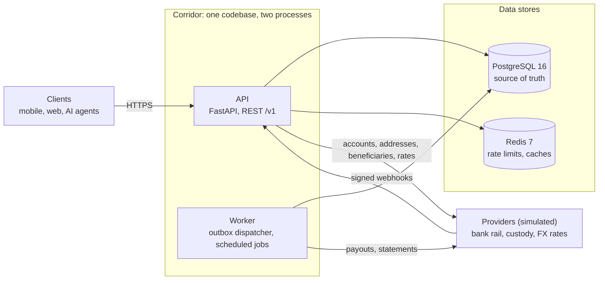
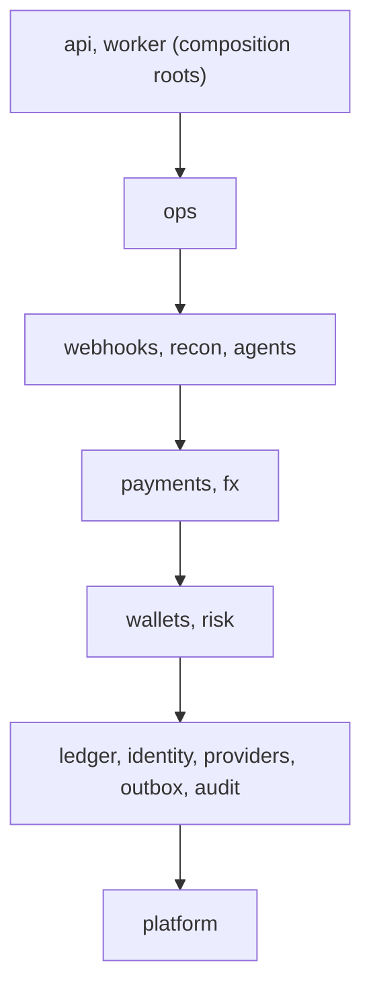
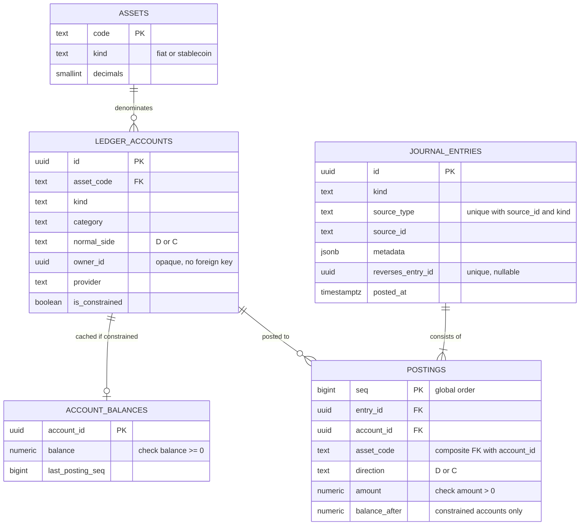
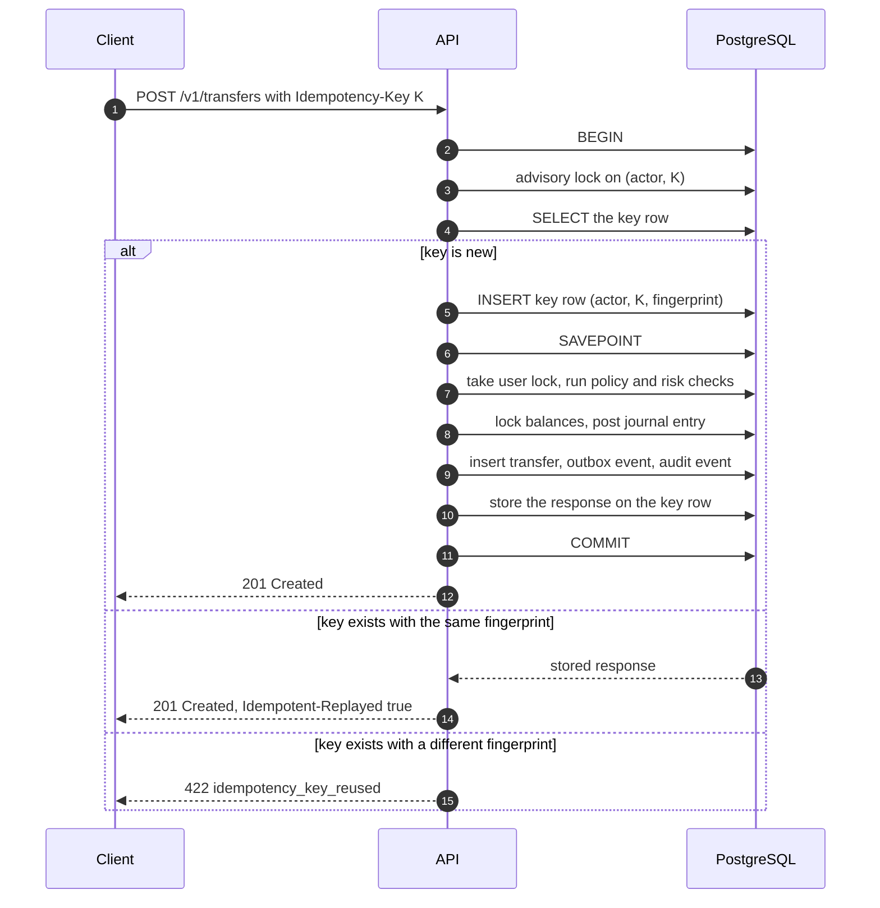
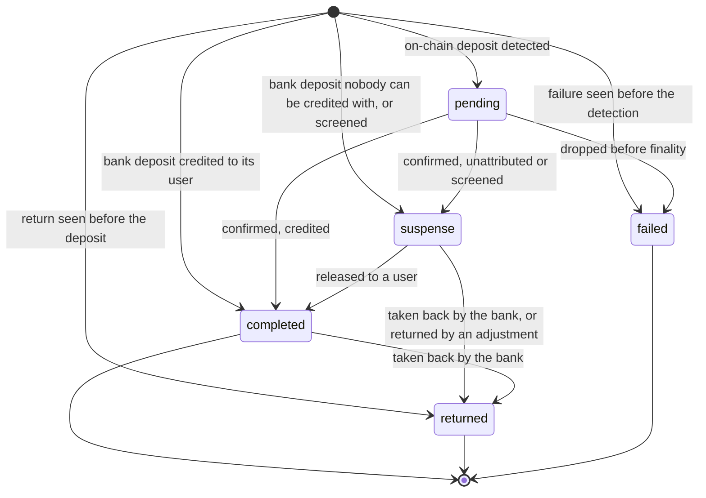
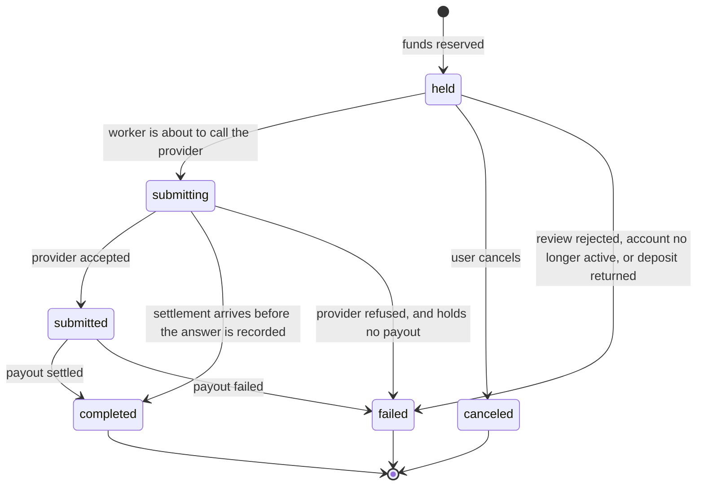
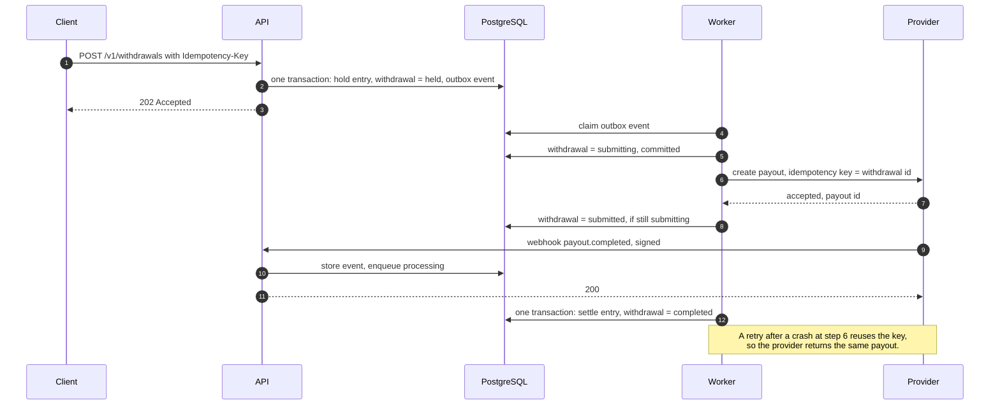
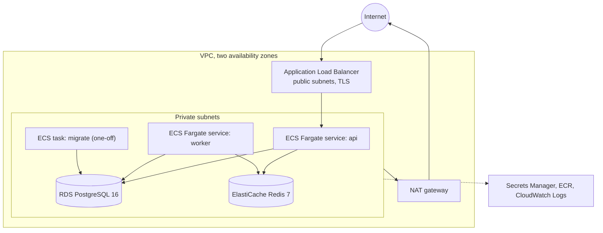

# Corridor — architecture

| | |
|---|---|
| **Status** | As built (v0.1.0) |
| **Scope** | Backend only: REST API, worker, data model, provider integrations, deployment |
| **Companions** | [API guide](api.md), [runbook](runbook.md), [provider contract](provider-api.md), [decision records](adr/) |

Corridor is the backend for a consumer wallet that holds fiat and stablecoin balances side by
side. It serves a REST API to mobile, web and AI-agent clients, integrates with bank-rail and
crypto-custody providers, and keeps its own double-entry ledger. It is one Python codebase
(a modular monolith) that runs as two processes, with PostgreSQL as the system of record,
Redis for ephemeral state, and AWS as the deployment target.

The providers are simulated inside this repository, so no real money moves. Everything on
Corridor's side of that boundary is built the way a production system would be.

This document describes the system as the code implements it. Where the code and this
document disagree, the code is right and this document has a defect.

## Contents

1. [Goals](#1-goals)
2. [System overview](#2-system-overview)
3. [Module map](#3-module-map)
4. [Money and the ledger](#4-money-and-the-ledger)
5. [Concurrency and transactions](#5-concurrency-and-transactions)
6. [Idempotency](#6-idempotency)
7. [Asynchronous work](#7-asynchronous-work)
8. [Money flows](#8-money-flows)
9. [Risk, compliance and audit](#9-risk-compliance-and-audit)
10. [Reconciliation](#10-reconciliation)
11. [Agents: delegated spending](#11-agents-delegated-spending)
12. [API design](#12-api-design)
13. [Security](#13-security)
14. [Data stores and settings](#14-data-stores-and-settings)
15. [Observability](#15-observability)
16. [Testing strategy](#16-testing-strategy)
17. [Local development](#17-local-development)
18. [AWS deployment](#18-aws-deployment)
19. [Stack](#19-stack)
20. [Decision log](#20-decision-log)
21. [How this scales and where it splits](#21-how-this-scales-and-where-it-splits)
22. [Known limits of this build](#22-known-limits-of-this-build)

---

## 1. Goals

### Design goals, in priority order

1. **Money is conserved.** Every movement is a balanced double-entry journal entry. History is
   append-only. The database refuses an unbalanced or edited entry even if the application
   has a bug.
2. **No double spend.** Concurrent requests against the same balance cannot both succeed when
   only one can be afforded.
3. **Retries are safe.** A client retry, a worker retry or a duplicate webhook produces the
   effect once.
4. **Every crash point converges.** If a process dies between any two steps, the system
   reaches a correct state without manual repair: by retry, by a sweeper, or by reconciliation.
5. **Boundaries are enforced, not agreed.** Module boundaries are checked in CI, so the
   monolith can be split later along lines that already exist.
6. **It is operable.** Structured logs, metrics, health checks, rate limits, least-privilege
   database roles, and a one-command local stack.

### Non-goals

Real money, real identity verification, real key custody, a frontend, cards, lending, yield,
multi-region deployment, and treasury or hedging of the FX position. Section 21 says how
several of these would be approached.

### Success criteria

Each criterion names the command or the test that shows it.

| # | Criterion | How it is checked |
|---|---|---|
| S1 | The ledger holds its invariants after every test, including the concurrency and failure-injection suites | The `db` test fixture runs the ledger verifier when each test ends and fails the test on any finding; `corridor verify-ledger` does the same against a running stack |
| S2 | 200 concurrent debits against a balance that affords 50 result in exactly 50 successes and no negative balance | `tests/ledger/test_concurrency.py` |
| S3 | 50 concurrent identical requests with one idempotency key produce one effect and 50 identical responses; the same key with a different body is rejected | `tests/api/test_idempotency.py` |
| S4 | For every withdrawal, the provider records exactly one payout under injected crashes, timeouts, duplicate webhooks and out-of-order webhooks | `tests/chaos` against the simulator |
| S5 | Reconciliation repairs a dropped deposit webhook and reports an amount mismatch | `tests/recon`, and the end-to-end run |
| S6 | Lint, strict type check, module-boundary contracts, the test suite and the coverage thresholds pass | `uv run poe check` |
| S7 | API, worker and simulators run as real processes and a scripted end-to-end scenario passes | `uv run poe e2e` |
| S8 | Coverage (lines and branches together) is at least 94% overall and at least 96% on `ledger`, `payments`, `fx` and `risk` | The `coverage` step of `uv run poe check` |

The dependency audit (`uv run poe audit`) and the secret scan are separate from
`poe check`; CI runs both as jobs of their own.

---

## 2. System overview



| Component | Responsibility | State it owns | Scales by |
|---|---|---|---|
| **API** | Authenticates callers, validates input, runs each synchronous operation in one database transaction, accepts webhooks | None (stateless) | Adding processes behind the load balancer |
| **Worker** | Drains the outbox, sends payouts to providers, applies stored webhooks, runs scheduled jobs (payout sweeper, reconciliation, ledger verifier, purges) | None (stateless) | Adding processes; work is claimed with `SKIP LOCKED`, and each scheduled job takes an advisory lock |
| **PostgreSQL** | The only source of truth: ledger, business state, outbox, idempotency keys, audit log | Everything durable | Vertically first; see section 21 |
| **Redis** | Rate-limit buckets, the FX rate cache, session revocation marks | Nothing that cannot be rebuilt | Not a bottleneck at this scale |
| **Simulators** | Stand in for a bank-rail provider, a custody provider and an FX rate source, with failure injection | Their own in-memory books | Test infrastructure only |

The API calls a provider directly in three places, always with no transaction open: to
obtain deposit instructions, to register a beneficiary, and to fetch an FX rate for a
quote. The worker does not use Redis.

Two rules shape everything else:

- **PostgreSQL is the only source of truth.** Redis can be flushed at any moment without
  losing or corrupting money. Each Redis use has a defined behaviour for when Redis is
  unavailable (section 14).
- **A database transaction never spans a network call.** The API commits intent; the worker
  performs the external call; the result is committed in a second transaction.

---

## 3. Module map

```text
src/corridor/
  platform/     config, database session and locks, redis, rate limiter, logging and
                redaction, errors, ids, money, clock, metrics, pagination
  identity/     users, passwords, signing keys, tokens, sessions, principals, login lockout
  ledger/       accounts, journal entries, postings, balances, verifier; the only writer of
                ledger tables
  providers/    ports (Protocols) and HTTP adapters: bank rail, custody, FX rates
  outbox/       outbox table, dispatcher, handler registry, retry policy
  audit/        append-only audit log
  wallets/      a user's accounts per asset, balances, statements
  risk/         limits and usage, reference rates, deny list, screening, reviews
  payments/     transfers, deposits, deposit instructions, beneficiaries, withdrawals,
                returns, payout sweeper
  fx/           rate cache, quotes, conversions
  webhooks/     inbound provider webhooks: verify, store once, process later, redact
  recon/        reconciliation runs, breaks and repair
  agents/       agents, API keys, spend policies, approval requests
  ops/          dead letters, reviews, adjustments with dual approval
  api/          app factory, routers, auth and idempotency dependencies, rate-limit and
                body-limit middleware, error rendering
  worker/       worker entry point: outbox loop, scheduler, scheduled jobs, webhook routing
  cli.py        serve, worker, db migrate, keys generate, verify-ledger, demo
  demo.py       the narrated demo, written as a client of the API
src/corridor_sim/  a separate FastAPI app: bank rail, custody and FX simulators
migrations/     Alembic revisions, hand-written
infra/          Terraform for AWS
scripts/        smoke test, end-to-end runner, documentation linter
tests/
```



A module may import only from layers below it, and modules in the same layer do not import
each other. Three rules make the boundaries real:

1. **Tables are private.** Only the owning module's code touches its tables. Other modules
   call its service functions and get frozen dataclasses back. There are no foreign keys
   between modules: a ledger account refers to its owner by an opaque id.
2. **Entry points own the transaction.** An HTTP handler, an outbox handler or a scheduled job
   opens one transaction and passes the session down explicitly. No service function commits
   or opens a transaction, so it is always clear what commits together.
3. **CI enforces it.** `import-linter` contracts encode the layers, forbid any module from
   importing another module's `models`, and forbid `corridor` and `corridor_sim` from
   importing each other. A violation fails `uv run poe contracts`.

| Module | Owns tables | What other modules may ask of it |
|---|---|---|
| `ledger` | `assets`, `ledger_accounts`, `account_balances`, `journal_entries`, `postings` | open an account, post an entry, reverse an entry, read balances and statements, verify |
| `identity` | `users`, `refresh_tokens`, `login_lockouts`, `login_throttles` | register, log in, issue and rotate tokens, check a token, resolve a principal, look up a user, change tier, role and status |
| `providers` | none | bank rail, custody and rate-source clients; address validation |
| `outbox` | `outbox_events` | enqueue an event inside the caller's transaction; register a handler; list and requeue dead events |
| `audit` | `audit_events` | record an audit event inside the caller's transaction |
| `wallets` | `wallet_accounts` | provision a user's accounts, resolve account ids, read balances, list statements |
| `risk` | `risk_limits`, `risk_usage`, `risk_reference_rates`, `risk_denylist`, `risk_reviews` | authorise a money movement and count it, release usage, value an amount in USD, screen a party, open and resolve a review, restrict a user |
| `payments` | `transfers`, `deposits`, `deposit_instructions`, `beneficiaries`, `withdrawals` | create transfers; apply provider events to deposits and withdrawals; request, cancel, submit and sweep withdrawals |
| `fx` | `fx_quotes`, `fx_conversions` | fetch a rate, quote, convert |
| `webhooks` | `webhook_events` | verify, record and process a delivery |
| `recon` | `recon_runs`, `recon_breaks` | run a reconciliation, list runs and breaks, resolve a break |
| `agents` | `agents`, `agent_keys`, `agent_policies`, `agent_allowed_recipients`, `agent_approval_requests` | authenticate an API key, manage agents and policies, check a policy, request and decide approvals |
| `ops` | `ops_adjustments` | dead-letter administration, review decisions, adjustments |
| `api` | `idempotency_keys` | none; it is an entry point |
| `worker` | `job_runs` | none; it is an entry point |

One deliberate exception: the worker deletes expired rows from `idempotency_keys`, which is
the API's table, with one plain SQL statement (`worker/purge.py`). The purge is scheduled
work and must not run in the API process, and the worker cannot import the API.

---

## 4. Money and the ledger

### 4.1 Representing money

- An amount is an **integer count of the asset's smallest unit**. There is no floating point
  anywhere in the money path.
- The column type is `NUMERIC(38,0)`, mapped to Python `int` by the `MinorUnits` column type,
  which refuses to bind anything that is not an `int`. `BIGINT` would overflow at about 9.2
  units of an 18-decimal token.
- Each asset records its `decimals`. The assets are `USD` (2), `MXN` (2), `BRL` (2) and
  `USDC` (6).
- The API carries amounts as **decimal strings in major units** (`"12.34"`), validated
  against the asset's scale. JSON numbers lose precision above 2^53 in JavaScript clients.
  `corridor.platform.money` is the only code that converts between the two forms.
- Rounding happens in two places, and both favour Corridor's books over creating value: an
  FX quote rounds the customer's buy amount down, and a movement's USD value for limits
  rounds up.

### 4.2 Chart of accounts

Balances are tracked from the operator's point of view: what customers hold is a liability,
and what sits at a bank or custodian is an asset.

| Account kind | Category | Normal side | One per | Constrained | Meaning |
|---|---|---|---|---|---|
| `user_available` | liability | credit | user and asset | **yes** | Spendable balance |
| `user_held` | liability | credit | user and asset | **yes** | Reserved for in-flight withdrawals |
| `user_receivable` | asset | debit | user and asset | **yes** | What a user owes after a returned deposit |
| `bank_settlement` | asset | debit | provider and fiat asset | no | Cash at the bank partner |
| `custody_omnibus` | asset | debit | provider and stablecoin | no | Tokens at the custodian |
| `suspense` | liability | credit | asset | no | Funds received but not attributable, or held for review |
| `fx_position` | asset | debit | asset | no | The operator's FX exposure |
| `fee_revenue` | revenue | credit | asset | no | Fees earned |
| `provider_fee_expense` | expense | debit | asset | no | Network and payout fees paid to providers |

A **constrained** account may never go below zero. It has a cached balance row, and posting
to it takes a row lock. An unconstrained account has neither and may go negative. The
distinction drives the locking design in section 4.6.

`suspense` is unconstrained so that deposits do not queue behind one row, but its balance
is not meant to go below zero: every debit of it is tied to a deposit that is checked to
be in suspense under a row lock (section 8.2), and the ledger verifier reports a negative
suspense balance as a finding.

A user's `user_available` and `user_held` accounts are opened when the user registers. The
`user_receivable` account and the system accounts are opened the first time they are needed.

### 4.3 Tables



A posting carries an explicit direction and a positive amount, which reads the way
accountants read a ledger. An account's balance is the sum of postings on its normal side
minus the sum on the other side.

### 4.4 Entry catalogue

Every movement in the system is one of these entries. `a` is the amount, `f` Corridor's fee,
`p` the provider's fee. `D` is a debit and `C` a credit. The entry kind is the value stored
in `journal_entries.kind`.

| Movement | Entry kind | Postings |
|---|---|---|
| Fiat deposit | `deposit` | D `bank_settlement` a · C `user_available` a |
| Stablecoin deposit | `deposit` | D `custody_omnibus` a · C `user_available` a |
| Deposit to suspense | `deposit_suspense` | D settlement or omnibus a · C `suspense` a |
| Release from suspense | `deposit_release` | D `suspense` a · C `user_available` a |
| Returned deposit, credited to a user | `deposit_return` | D `user_available` min(a, available) · D `user_receivable` shortfall · C `bank_settlement` a |
| Returned deposit, still in suspense | `deposit_return` | D `suspense` a · C `bank_settlement` a |
| Transfer between users | `transfer` | D sender `user_available` a+f · C recipient `user_available` a · C `fee_revenue` f |
| Withdrawal hold | `withdrawal_hold` | D `user_available` a+f · C `user_held` a+f |
| Withdrawal settle | `withdrawal_settle` | D `user_held` a+f · D `provider_fee_expense` p · C settlement or omnibus a+p · C `fee_revenue` f |
| Withdrawal release | `withdrawal_release` | D `user_held` a+f · C `user_available` a+f |
| Conversion | `conversion` | D `user_available` (sell asset) s · C `fx_position` (sell asset) s · D `fx_position` (buy asset) b · C `user_available` (buy asset) b |
| Adjustment | `adjustment` | Any balanced postings, requested by one admin and approved by another |
| Reversal | `reversal` | The original entry with D and C swapped, linked by `reverses_entry_id` |

A conversion is one entry that balances in each asset separately. Zero-amount postings are
omitted, so a fee-free transfer has two postings. An account appears at most once in an
entry.

An entry is identified by `(source_type, source_id, kind)`. The source is the business
object: `transfer`, `withdrawal`, `fx_conversion` and `adjustment` with the object's id,
`deposit` with the provider's name and its id for the deposit (`simbank:dep_…`), and
`journal_entry` with the reversed entry's id.

### 4.5 Invariants and where each is enforced

Each invariant has up to three layers: the application refuses to create a violation, the
database refuses to store one, and a verifier detects one after the fact.

| Invariant | Application | Database | Verifier |
|---|---|---|---|
| Debits equal credits per asset in every entry | `post_entry` rejects an unbalanced draft | Deferred constraint trigger checks the entry at commit (`CR003`) | `unbalanced_entry` |
| An entry has at least two postings | `post_entry` | The same deferred trigger, on `journal_entries` and on `postings` (`CR002`) | `too_few_postings` |
| Entries and postings are never edited or deleted | No update or delete code exists | Statement-level `BEFORE UPDATE OR DELETE OR TRUNCATE` triggers raise (`CR001`); the application role has no `UPDATE` or `DELETE` grant on these tables | n/a |
| A posting is written by the transaction that wrote its entry | One code path writes both | `BEFORE INSERT` trigger on `postings` refuses a posting for an entry whose writing transaction has ended (`CR004`) | n/a |
| A posting's asset matches its account's asset | Account lookup | Composite foreign key `(account_id, asset_code)` | n/a |
| A constrained account never goes below zero | Balance check under lock | `CHECK (balance >= 0)` on the balance row and on `balance_after` | `negative_balance` |
| A cached balance equals the sum of its postings | One code path updates both | n/a | `balance_mismatch`, `broken_balance_chain`, `stale_balance_pointer` |
| A constrained account has a balance row and no other account does | `open_account` | `CHECK` on account kind, owner, provider and `is_constrained` | `missing_balance_row`, `unexpected_balance_row`, `stray_balance_after` |
| One business event posts at most once | `post_entry` returns the existing entry | `UNIQUE (source_type, source_id, kind)` | n/a |
| An entry is reversed at most once | `reverse_entry` | `UNIQUE (reverses_entry_id)` | n/a |
| Suspense never goes below zero | Deposit status check under a row lock | n/a | Reported as a finding |

Corrections are new entries. Nothing in the ledger is ever changed.

The same `forbid_mutation` trigger makes `audit_events` append-only and makes `transfers`,
`fx_conversions`, `beneficiaries` and `deposit_instructions` write-once. Every trigger
function pins its `search_path` with the temporary schema last, so that a session's
temporary table cannot stand in for a real one, and the application role cannot create
temporary tables.

### 4.6 Balances: cached where constrained, derived elsewhere

A balance check has to be atomic with the debit, which means a row lock. Locking is cheap on
a user's own account and expensive on an account every transaction touches: if `fee_revenue`
had a locked balance row, every fee-bearing transfer in the system would queue behind it.

- **Constrained accounts** (`user_available`, `user_held`, `user_receivable`) have a row in
  `account_balances`. Posting locks that row, checks the result, and updates it. Contention
  is per user.
- **Unconstrained accounts** (settlement, omnibus, suspense, FX position, revenue, expense)
  have no cached balance and take no lock. Postings are appended and the balance is computed
  from them on read.

This removes the hot-account bottleneck by design rather than by tuning. At larger volume the
derived balances would be served from periodic snapshots plus the postings since the
snapshot; section 21 covers that.

### 4.7 Posting algorithm

`ledger.post_entry(session, draft)` runs inside the caller's transaction. Every check comes
before the first write, so a refused entry has written nothing and the caller's transaction
stays usable. There is no savepoint.

1. Validate the draft: a kind and a source, at least two postings, positive integer amounts,
   each account named once.
2. Load the accounts. Every one must exist. Debits must equal credits per asset.
3. Lock the `account_balances` rows of the constrained accounts involved, **in ascending
   account id order**, `FOR NO KEY UPDATE`.
4. If an entry with the same `(source_type, source_id, kind)` exists, return it with
   `created = False`. If its postings differ from the draft, raise `ConflictingEntry`. This
   comes after the locks because a concurrent transaction posting the same event holds the
   same locks, and before the funds check because a replay must be recognised even if the
   balance has since been spent.
5. Compute the new balances. If any would be negative, raise `InsufficientFunds`.
6. Insert the entry with `ON CONFLICT DO NOTHING`. If a concurrent transaction that shares
   no constrained account inserted the same source first, return that entry.
7. Insert the postings in one statement, with `balance_after` for constrained accounts.
8. Update the locked balance rows.

Callers check `created`. A transfer, a withdrawal or a conversion whose id was already
posted is a bug in the caller, which makes a new id for each attempt, and raises.

---

## 5. Concurrency and transactions

**Isolation.** `READ COMMITTED` with explicit locks. The alternatives were considered:

| Option | Why not |
|---|---|
| `SERIALIZABLE` everywhere | Every use case needs a retry loop, and busy accounts produce a steady rate of aborts. Explicit locks state exactly what is being protected. |
| Optimistic versioning (compare-and-swap on a version column) | Works, but turns contention into retries, and retries are exactly what a busy balance cannot afford. A short row lock queues instead. |
| `CHECK` constraint as the only guard | A violated constraint aborts the whole transaction, so the outcome could not be recorded for an idempotent replay. The constraint stays as a backstop. |

**Lock order.** Deadlocks are prevented by always taking locks in this order:

1. The idempotency key: a transaction-scoped advisory lock on the actor and the key.
2. Per-user money-out advisory locks, in ascending order of the lock key.
3. The business row being advanced (`SELECT … FOR UPDATE` on a withdrawal, a deposit, a
   quote, an approval request or an adjustment).
4. Balance rows, ascending by account id, `FOR NO KEY UPDATE`.

An advisory lock key is the first 64 bits of a SHA-256 over a namespace and an id. Several
keys are always taken in ascending key order, which is a total order even if two ids were to
hash to one key.

**The per-user money-out lock.** Daily limits are across all of a user's assets, but balance
rows are per asset. Two concurrent sends in different assets would each read the same
day-to-date total and both pass. A transaction-scoped advisory lock keyed on the user
serialises that user's outgoing operations, which makes the limit check and the balance
check race-free without serialising anyone else. It is taken by:

| Path | Whose lock |
|---|---|
| Transfer, withdrawal request, conversion | The user whose money moves out |
| Approving an agent's request | The owner, before the request's row |
| Approving an adjustment | Every user whose available balance the adjustment debits |
| A returned deposit | The user the deposit was credited to |
| Restricting a user | That user, so the restriction waits for a movement in flight and every later movement sees it |

A recipient is not locked: only the sender moves money out.

**Other advisory locks.** A login takes a lock on the digest of the email address in its own
short transaction, so failure counts are not lost. Asking for an approval takes a lock per
agent, so two requests cannot both take the last free place. Changing a KYC tier takes a
lock per user, so each change is audited with the tier it really replaced. Each scheduled
job holds a session-level advisory lock for the length of its run. None of these is taken
together with a money-out lock in the opposite order.

**Transaction hygiene.**

- One transaction per unit of work; no transaction is open during a network call or while
  a password is hashed.
- `lock_timeout` 5s, `statement_timeout` 10s, `idle_in_transaction_session_timeout` 15s, set
  on every connection. The session time zone is pinned to UTC.
- `Database.run` re-runs a unit of work after a deadlock (`40P01`) or a serialisation
  failure (`40001`), up to three times, with jitter. With the lock order above they should
  not occur; the retry is a seatbelt, and `corridor_db_transaction_retries_total` counts
  every use of it.
- A refusal that must leave a record (a failed login, a reused refresh token, an approved
  request whose movement was refused) is returned from the transaction and raised by the
  entry point after the commit, because raising inside would roll the record back.
- Business time comes from `corridor.platform.clock.utcnow()` and is passed into SQL as a
  parameter. No application query calls `now()`.

---

## 6. Idempotency

Every request that creates a money movement must carry an `Idempotency-Key` header. The
status codes follow the IETF draft for that header, and the store-and-replay behaviour is the
one Stripe documents for its API. The client-facing rules are in the
[API guide](api.md#idempotency).

**The key and the effect commit in the same transaction.** That is the whole design:



- **Scope.** A key is unique per actor: the user, or one agent. The fingerprint is a SHA-256
  over the method, the concrete request path and the canonical JSON body, each hashed with
  its length in front. Because the path carries the ids, a key used to approve one
  adjustment cannot answer for another.
- **Concurrent duplicates.** The second request waits on the advisory lock until the first
  transaction finishes, then reads the committed row and replays its response. If the wait
  exceeds `lock_timeout`, the client gets `409 request_in_progress` with `Retry-After: 1`.
  The primary key on `(actor_id, key)` remains as the safety net.
- **What is stored.** The status code, body and headers of the first completed attempt. A
  `DomainError` raised by the work is caught: the savepoint undoes what the work wrote, and
  the refusal is stored as the response. A key identifies one attempt, so retrying a
  declined request with the same key returns the same decline.
- **What is not stored.** Authentication failures and malformed requests, which are rejected
  before the key is read, and unexpected errors, where the transaction rolls back and takes
  the key with it. The client can safely retry those.
- **Lifetime.** Keys are deleted 24 hours after they were created, by an hourly job.

`POST /v1/beneficiaries` takes a key and does not store it. Registering a beneficiary is a
call to the bank, and storing a response would mean a transaction open across that call.
The key is handed to the bank, which answers a repeat with the account it registered first.

**Why PostgreSQL and not Redis.** A key held in Redis cannot commit atomically with a ledger
entry in PostgreSQL. Every ordering of the two writes leaves a window where a crash produces
either a double spend or a stuck key. Keeping the key next to the effect removes the window.

There is a second, independent layer underneath: the ledger's `UNIQUE (source_type,
source_id, kind)` means a business event cannot post twice even if a handler runs twice.

---

## 7. Asynchronous work

### 7.1 Transactional outbox

Anything that must happen after a commit (calling a provider, applying a webhook) is written
as a row in `outbox_events` **in the same transaction** as the state change that causes it.
The event exists if and only if the state change committed.

The worker claims events in a short transaction. In outline:

```sql
WITH due AS MATERIALIZED (
    SELECT id FROM outbox_events
     WHERE (status = 'pending' AND available_at <= :now)
        OR (status = 'processing' AND locked_until < :now)
     ORDER BY id
     LIMIT :batch
     FOR UPDATE SKIP LOCKED)
UPDATE outbox_events e
   SET status = 'processing', attempts = attempts + 1,
       locked_until = :now + :claim_seconds, claim_id = :new_claim_id
  FROM due WHERE e.id = due.id
RETURNING e.*;
```

- **At-least-once delivery.** A handler may run more than once, so every handler is
  idempotent and states which key makes it so.
- **Claims.** A claim lasts 60 seconds. A handler is cancelled at 90% of that, so that its
  failure is recorded under its own claim. Each claim has a new `claim_id`, and a worker
  records its result only where that id is still on the row, so a worker whose claim ran
  out cannot overwrite the result of the worker that took over.
- **Crash recovery.** Events held by a dead worker are picked up again when the claim
  expires. An event whose claim expired on its last attempt is marked `dead` in the same
  statement instead of being claimed again: a handler that kills or hangs its worker would
  otherwise be tried for ever.
- **Retries.** After a failure the event waits a random time between zero and a ceiling
  that starts at 2 seconds and doubles to at most 5 minutes ("full jitter"), for up to 8
  attempts. After that it is `dead`, a metric counts it, and an admin endpoint can list and
  requeue it. An event whose topic has no handler is marked `dead` at once.
- **Latency.** An insert trigger issues `NOTIFY corridor_outbox`; workers `LISTEN` and wake
  immediately. A 5-second poll remains as the reliable path, because notifications are not
  delivered to a worker that is reconnecting.
- **Ordering.** Not guaranteed across events. Handlers are guarded by state machines instead,
  so an out-of-order event is a no-op rather than a bug.
- **Tracing.** The request id of the request that enqueued an event is stored with it and
  bound to the log context while the event is handled.
- **Retention.** Finished events are deleted after 7 days. Dead events are never deleted.

| Topic | Enqueued by | Handler |
|---|---|---|
| `webhook.received` | Recording a provider's delivery | Applies the stored event through the payment functions |
| `withdrawal.submit` | Requesting a withdrawal; clearing its review; the sweeper | Sends the withdrawal to its provider |
| `transfer.completed`, `deposit.completed`, `fx.converted` | The movement | Nothing yet. A handler is registered so the event ends as `done` |
| `worker.ping` | An operator | Nothing. It shows that a worker is running |

### 7.2 Scheduled jobs

Every worker runs a scheduler that looks at every job once a second. Two mechanisms keep a
job from running twice. A session-level advisory lock, held for the whole run, means no two
workers run it at the same moment. The job's row in `job_runs` records when it last
started, so a worker that comes to the job after another has finished it finds that it is
not due. A job that fails records its error on the row and is due again after its interval.

| Job | Every | What it does |
|---|---|---|
| `payments.sweep_payouts` | 30 seconds | Asks the provider about withdrawals that have been in flight too long (section 7.5) |
| `recon.run` | `reconciliation_interval_seconds` (5 minutes) | Reconciles each provider against the books (section 10) |
| `ledger.verify` | 1 hour | Runs the ledger verifier and sets its gauges |
| `outbox.purge_finished` | 1 hour | Deletes outbox events that finished more than 7 days ago |
| `idempotency.purge_expired` | 1 hour | Deletes idempotency keys older than 24 hours |
| `fx.purge_unused_quotes` | 1 hour | Deletes quotes that expired more than 24 hours ago and were never converted |
| `auth.purge_login_failures` | 1 hour | Deletes login failure counts that nothing has added to for 24 hours |
| `webhooks.redact_payloads` | 1 hour | Removes personal fields from the payloads of events processed more than 30 days ago |

The payout sweeper and reconciliation exist only on a worker that has a provider
configured.

### 7.3 Calling providers

- The call happens outside any transaction, with one deadline for the whole call
  (`provider_timeout_seconds`, 5 seconds).
- Every mutating call carries an idempotency key derived from Corridor's own id for the
  operation (the withdrawal id for a payout). A retry after a timeout cannot create a second
  payout.
- The adapter sorts every answer into one of three outcomes. **Rejected**: a `4xx` with the
  contract's error body; nothing happened. **Unknown**: a timeout, a broken connection, a
  `5xx`, or a body that does not match the contract; nothing can be said. **Misconfigured**:
  no address, no key, or a `401`; nothing happened and no retry helps.
- An unknown outcome is never treated as a failure. The event is retried with the same key,
  and the sweeper resolves anything still unsettled.
- A response is parsed against a strict model and compared with what was asked before any
  of it is used. Response bodies are capped at 1 MiB and never logged.
- Adapters implement a `Protocol` per provider type, so a real provider is a new adapter and
  nothing else changes.

### 7.4 Inbound webhooks

1. **Verify.** HMAC-SHA256 over the timestamp and the raw request body, constant-time
   comparison against every active secret, 5-minute tolerance. Exactly one `X-Signature`
   header with exactly one `t` and one `v1` is accepted. A provider with no secret
   configured is refused, never trusted.
2. **Parse.** Only after verification. The envelope is validated strictly; a body that is
   not an event is `422`.
3. **Persist.** Insert into `webhook_events` with `UNIQUE (provider, event_id)`, and enqueue
   `webhook.received`, in one transaction. A duplicate delivery inserts nothing and is
   acknowledged all the same.
4. **Acknowledge.** Return `200` once the transaction has committed.
5. **Process.** The worker applies the event through the same state machines as every other
   path. An event of a type no handler knows is stored and marked `ignored`.

Acknowledging before processing keeps a slow handler from causing provider retries, and
storing the raw event means any webhook can be processed again. The two providers must not
share a secret, because the provider's name is not among the signed bytes; the API refuses
to start if they do. Thirty days after an event is processed, the personal fields of its
payload (`sender_name`, `reference`, `from_address`) are set to null.

### 7.5 Safety nets

Webhooks get lost. Two mechanisms make that survivable:

- **Payout sweeper.** Every 30 seconds, withdrawals that have been `submitted`, or left
  `submitting`, for longer than `payout_sweep_after_seconds` (2 minutes) are checked against
  the provider's API and advanced through the same functions the webhooks use. A withdrawal
  left `submitting` that the provider knows nothing of is asked to be sent again, under the
  same idempotency key, because its own outbox event may be dead.
- **Reconciliation.** Section 10. It finds what both the webhook and the sweeper missed,
  including deposits whose webhook never arrived.

### 7.6 Failure matrix

| Failure | What happens | Why money is safe |
|---|---|---|
| API crashes before commit | Nothing was written; the client retries with the same key | One transaction; all or nothing |
| API crashes after commit, before responding | The retry replays the stored response | Key and effect committed together |
| Worker crashes before calling the provider | The claim expires and the event is retried | No external effect happened; the withdrawal is `submitting` and is sent under the same key |
| Worker crashes after the provider accepted, before commit | The retry sends the same idempotency key; the provider returns the same payout | Provider-side idempotency |
| Provider times out | Outcome unknown; retried with the same key, then swept | Never assumed failed, so funds stay held |
| Provider refuses a retry of a request it already carried out | Corridor asks the provider what it holds under the reference before releasing anything | Funds are released only if the provider holds no payout |
| User cancels while the worker is sending | The cancellation is refused: the withdrawal is no longer `held` | `submitting` is committed before the provider is called |
| Webhook delivered twice | The second insert conflicts and is dropped | `UNIQUE (provider, event_id)` |
| Webhooks arrive out of order | The state machine ignores transitions that no longer apply | Guards on current state under a row lock |
| Webhook never arrives | The sweeper or reconciliation advances the state | Provider is polled as a fallback |
| Handler runs twice | The second posting returns the existing entry | `UNIQUE (source_type, source_id, kind)` |
| Redis is down | Address rate limits fail open, rates are fetched from the source, the revocation mark is skipped, and requests that move money are refused with `503` | Redis holds no money state |
| An event fails 8 times | Marked `dead`, counted, requeued by an operator | Funds remain held, never lost |

---

## 8. Money flows

### 8.1 Transfer between users

Synchronous, one transaction: idempotency key, agent policy check (for an agent), recipient
lookup, the sender's money-out lock, risk authorisation, fee calculation, ledger entry,
`transfers` row, outbox event, audit event, stored response. Recipients are addressed by
handle (`@maria`), email address or user id. A transfer row is written once and never
changes; its only status is `completed`.

### 8.2 Deposit

Deposits are initiated at the provider, so Corridor learns about them by webhook.

- **Instructions.** A user asks for deposit instructions for an asset. Corridor obtains a
  virtual bank account (fiat) or a deposit address (stablecoin) from the provider once, with
  an idempotent call made between two transactions, and stores it.
- **Attribution.** A deposit belongs to the user whose stored instruction names the virtual
  account or address it arrived at, for that asset. Nothing else in the event is believed.
  A deposit that arrives at an account Corridor did not issue belongs to nobody.
- **Bank deposit.** `deposit.received` records the deposit and credits it in one
  transaction, keyed by the provider's id for the deposit.
- **On-chain deposit.** `deposit.detected` records the deposit as `pending` with no ledger
  effect. `deposit.confirmed`, sent once the simulated chain reaches the required
  confirmation count, credits it; it also records the deposit if the detection never
  arrived. A deposit that is dropped before finality is marked `failed` and never touched
  the ledger.
- **Suspense.** A deposit that belongs to nobody, and a deposit whose sender is on the deny
  list (with either outcome), is credited to `suspense` instead of to a user. A screened
  deposit also gets a review, which remembers the user it would have gone to.
- **Returns.** A bank can return a deposit after it was credited. The return first releases
  the user's unsent withdrawals of that asset, then debits what the user still has, books
  any shortfall to `user_receivable`, and restricts the user if there is a shortfall. A
  return can also arrive before its deposit; the deposit is then recorded as `returned`
  straight away, so that it credits nothing when it does arrive.



**Suspense money leaves once.** There are three ways out of suspense: an operator clears
the deposit's review, two operators approve a suspense-release or suspense-return
adjustment that names the deposit, or the bank returns the deposit. Each one locks the
deposit's row, requires its status to be `suspense`, posts its entry and changes the status
in the same transaction. Whichever comes second finds the deposit no longer in suspense. A
return that arrives after a release is the return of a credited deposit: it takes the money
back from the user. A release to a closed account is refused; a restricted account can be
credited.

### 8.3 Withdrawal

A withdrawal is a saga: reserve the funds, ask the provider, then settle or release.



- **Request.** In one transaction: check the target (a saved beneficiary for a fiat asset,
  a valid address for a stablecoin), screen it, take the money-out lock, authorise against
  the limits, post the hold entry for the amount plus the fee, insert the withdrawal as
  `held`, enqueue `withdrawal.submit`, write the audit event.
- **Screening.** A destination listed as `deny` is refused before anything is held. One
  listed as `review` is held like any other, and a review is opened. The withdrawal stays
  `held` and the submit handler leaves it alone until an operator clears the review, which
  enqueues the submission again. Rejecting the review releases the funds. There is no
  separate status for "under review": the withdrawal row says `held` and the open row in
  `risk_reviews` says why it is not moving.
- **Submit.** The handler locks the row. If the user's account is no longer active, the
  funds are released and the withdrawal ends as `failed`. Otherwise the withdrawal is marked
  `submitting`, **and that is committed before the provider is called**. Then the provider
  is called with no transaction open, with the withdrawal id as the reference and the
  idempotency key. Then the answer is recorded and the withdrawal becomes `submitted`.
- **Cancel.** Accepted only while the withdrawal is `held`, the one state in which the
  provider is certain not to have it. A cancellation either commits before the `submitting`
  mark, and then nothing is sent, or finds the mark and is refused. An agent may cancel
  only a withdrawal it requested; the user's own session may cancel any of the user's.
- **Refusal.** When the provider refuses the request, Corridor does not release the funds on
  that word alone. An earlier attempt whose reply was lost may already have made the payout.
  Corridor asks the provider what it holds under the withdrawal's reference, and releases
  only if the answer is nothing. An `idempotency_conflict` is treated as an unknown outcome,
  not a refusal.
- **Settle or fail.** `payout.completed` or `withdrawal.completed` posts the settle entry
  with both fees. `payout.failed` or `withdrawal.failed` posts the release entry. Both check
  that the event names this withdrawal's provider, asset, amount and payout, and move
  nothing on a mismatch. The same two functions serve the webhooks, the sweeper and
  reconciliation.

Every transition runs under `SELECT … FOR UPDATE` on the withdrawal row and checks the
current state first, so a late or repeated event changes nothing. Releasing a withdrawal
also gives back what it used of the user's limits.

The `status` column's `CHECK` constraint and the `WithdrawalStatus` type also allow
`under_review` and `released`. No code writes either value.



Funds are reserved by moving them between two of the user's ledger accounts, not by a
separate holds table. A hold is then visible in the same history, subject to the same
invariants, and impossible to forget when computing a balance.

Bank withdrawals go to a saved beneficiary. The account details are sent to the provider
once and Corridor stores only the provider's token and a masked display value.

### 8.4 FX conversion

1. **Quote.** `POST /v1/fx/quotes` returns a rate, both integer amounts and an expiry
   30 seconds out. The rate is the provider's mid rate less a configured spread (50 basis
   points). The mid rate is cached for 5 seconds, and Corridor refuses to quote from a rate
   older than 15 seconds or dated more than 5 seconds in the future.
2. **Convert.** `POST /v1/fx/conversions` with the quote id and an idempotency key executes
   the stored amounts in one transaction: money-out lock, quote row `FOR UPDATE`, risk
   authorisation, one ledger entry, quote marked `used`. Nothing is recomputed at execution
   time, so the customer gets exactly what was quoted or a refusal.

The buy amount is `floor(sell_amount × rate)` in minor units, computed in decimal arithmetic
with 120 digits of precision. Rounding down means a conversion can never create value, and
an amount that would buy nothing is refused. A property-based test asserts this over
generated amounts and rates. A quote that expired unused is deleted a day later.

### 8.5 Fees

A transfer fee and a withdrawal fee are each basis points of the amount, rounded down, and
never less than a per-asset minimum. The defaults are no transfer fee, and a withdrawal fee
of `0.25` USD, `5.00` MXN or `0.15` USDC. The provider's own fee for a payout is booked to
`provider_fee_expense` when the payout settles.

---

## 9. Risk, compliance and audit

The compliance functions are stubs with production-shaped interfaces. They exist so the
money paths have the right hooks and the right failure behaviour.

- **KYC tiers.** A user has tier 0, 1 or 2. The tier selects default limits. An admin
  endpoint changes it; real verification is out of scope. Tier 0 may withdraw.
- **Limits.** A rule in `risk_limits` sets a per-transaction maximum and a rolling 24-hour
  maximum, in whole US cents. A rule belongs to a tier, a user or an agent (`scope`), and
  covers one kind of movement (`transfer`, `withdrawal`, `conversion`) or all kinds. The
  most specific rule wins: a user's rule over the tier's, and a rule for one kind over a
  rule for all kinds. The seeded tier rules are 1,000 and 2,500 USD for tier 0, 10,000 and
  25,000 for tier 1, and 100,000 and 250,000 for tier 2.
- **Usage.** Every authorised movement writes a row to `risk_usage` in the movement's own
  transaction, with its value in US cents. The 24-hour total is the sum of the user's
  unreleased usage rows in the window, read under the money-out lock. A withdrawal that is
  canceled, failed or released marks its usage row `released_at`, and it stops counting.
  A movement's id makes its usage unique, so authorising twice counts once.
- **Valuation.** An amount is valued in USD with a fixed reference rate per asset from
  `risk_reference_rates` (seeded by migration: USD 1, USDC 1, MXN 0.058, BRL 0.18),
  rounded up to a whole cent. These rates are for limits only. Nothing is bought or sold at
  them.
- **Agent limits.** An agent's rule is a second limit inside its owner's, on what that
  agent alone has moved. It is written only by the owner's policy (section 11); the admin
  limits endpoint refuses `scope = agent`.
- **Screening.** `risk_denylist` holds names, addresses and account numbers, each stored in
  the normalised form screening compares in, with the outcome `deny` or `review`. Admins
  manage it through the API. A party that is not listed is `clear`.
- **Reviews.** `risk_reviews` holds one row per withdrawal or deposit that screening would
  not let through unseen. An admin clears or rejects it, once.
- **Restricted and closed users.** Only an `active` account moves money out. A `restricted`
  account (after a returned deposit left a shortfall) can still receive. A `closed` account
  cannot be paid and is answered as "not found" to other users. Restricting a user takes
  that user's money-out lock.
- **Audit log.** `audit_events` is append-only, protected by the same trigger as the ledger.
  Money movements write their audit event in the same transaction as the movement. Each
  event records the actor (`user`, `agent`, `admin`, `system` or `provider`), the user it
  acted for, the action, the resource, the outcome (`success`, `denied`, `failed`), the
  request id and a small JSON document of details. Admin reads are audited as well as admin
  writes. An approval event names the destination of the movement for every outcome.

---

## 10. Reconciliation

Each provider exposes a statement: its settled transactions and its closing balance. A run
compares that against Corridor's records for a half-open window `[window_start,
window_end)`. It works in three steps: read the providers with no transaction open; compare
and record in one transaction; then repair what it can.

Records are matched by the provider's own id for them and never by time, because the two
sides do not book a movement at the same moment. The statement is read from 24 hours
before the window for the same reason.

| Break kind | Meaning | Response |
|---|---|---|
| `missing_deposit` | The provider's statement has a deposit that Corridor has not credited | **Repaired**: the statement line is handed to payments as a deposit read from a statement, which credits it once |
| `missing_payout_result` | A withdrawal is still in flight here and the provider says it completed or failed | **Repaired**: the provider's answer is handed to the function its webhook would have reached |
| `unknown_deposit` | Corridor credited a deposit in the window that the statement does not list | Open break for an operator |
| `unknown_payout` | The provider paid out something Corridor has no matching withdrawal for, or Corridor shows a settled or sent payout the provider does not have | Open break |
| `amount_mismatch` | Both sides have the deposit or payout, with different amounts | Open break |
| `settlement_balance` | The settlement account's balance at `window_end`, after in-transit items, differs from the provider's closing balance | Open break. `provider_ref` is the asset code |

- **Repair is idempotent.** Both repairs go through payment functions that lock the row and
  look at its state, so a repair that races the late webhook, the sweeper or another run
  changes nothing twice. A break is closed by looking at Corridor's own records afterwards
  (`resolved_by = system`), not on the word of the repair.
- **A deposit repaired from a statement may be unscreened.** Neither provider's statement
  names the sender. The deposit goes to the user its account belongs to, and the audit
  event of the credit records `screened: false`.
- **Returned before it was seen.** A `missing_deposit` whose return is on the same statement
  is not credited. It is recorded as returned (the same tombstone a return webhook that
  overtakes its deposit leaves) and the break is closed.
- **Grace period.** A deposit younger than a grace period (a setting, 2 minutes by default)
  is left for its webhook and not repaired yet.
- **One open break per disagreement.** A unique index on `(kind, provider, provider_ref)`
  for open breaks means a later run that sees the same disagreement does not open a second
  break. It refreshes the open one instead: `expected`, `actual` and `last_seen_run_id` are
  updated, and a metric counts the times the difference changed.
- **Incomplete runs.** A provider that could not be read for everything the run asked makes
  the run `incomplete`. An incomplete run does not close payout breaks.
- **Schedule and window.** The worker runs reconciliation every
  `reconciliation_interval_seconds` (5 minutes) over the last
  `reconciliation_window_seconds` (1 hour). If the last completed run ended longer ago than
  that, the window starts where that run ended, up to 7 days back, so that an outage longer
  than the window is still covered.
- **Limits of one run.** It looks at up to 1,000 withdrawals in flight and 10,000 of
  Corridor's own records per provider and asset; beyond that the run is `incomplete`.

Runs and breaks are stored, exposed on the admin API and counted in metrics. An operator
resolves an open break with a note. The [runbook](runbook.md#reconciliation-breaks) says
what to check for each kind.

---

## 11. Agents: delegated spending

A user can let software act on their wallet without handing over their login.

- **Agent.** A named principal owned by a user (`agents`), `active`, `paused` or `revoked`.
  A user can have 20 that are not revoked.
- **Keys.** `ck_<environment>_<prefix>_<secret>`. The environment label is `dev`, `test` or
  `live`, and a key from another environment is not accepted. The 12-character prefix is
  stored and is how the key is found. The secret is 32 random bytes; only its HMAC-SHA256
  under `api_key_hash_key` is stored (`agent_keys.key_hash`). The key is shown once. The
  digest is computed before the lookup, so a key that names no row costs what a real one
  costs. A key can expire and can be revoked. An agent can have 10 working keys.
- **Scopes.** A key carries the operations it may perform, from a fixed list of ten
  (`wallet:read`, `transfers:create` and so on). A user session has every scope (`*`); no
  key can hold `*`, and the database refuses a key row that does. A scope added to the code
  later is not open to agents until it is added to that list on purpose.
- **Authentication.** A key is authenticated in a transaction of its own that commits before
  the handler's transaction begins, so the row lock taken to record `last_used_at` (at most
  once a minute) is released before any lock on money is taken. An agent's principal has
  the role `user` whatever its owner is: an admin who delegates their wallet has not
  delegated their office.
- **Spend policy.** `agent_policies` holds a per-transaction cap, a rolling 24-hour cap and
  an approval threshold, all in US cents, and whether the agent may pay anyone.
  `agent_allowed_recipients` lists the users and the owner's beneficiaries it may pay
  otherwise. Setting a policy copies the two caps into `risk_limits` as the agent's rule,
  so `risk` enforces them where the money moves.
- **Deny by default.** An agent with no policy row can pay nobody and cannot convert. A
  policy with an empty recipient list and `any_recipient = false` can pay nobody.
- **Policy check.** On every transfer and withdrawal by an agent, after the idempotency
  lock and before anything moves: the destination must be allowed; the amount must not
  exceed the per-transaction cap; and an amount above the threshold is answered with
  "requires approval". A conversion is checked against the per-transaction cap only: it has
  no recipient and is never sent for approval.
- **Approval.** For an amount above the threshold no money moves. An
  `agent_approval_requests` row records the intent and the id the movement will have. The
  owner approves or rejects it from their own session. Approval takes the owner's money-out
  lock, locks the request row, checks the agent is still active, checks the policy again
  (without the threshold), and makes the movement as the agent in the same transaction. A
  request expires after 24 hours. An agent has at most 20 requests waiting.
- **Exactly once.** Three things keep an approved movement from being made twice: the
  request row is locked and must still be `pending`; its status changes in the transaction
  that moves the money; and the movement is made under the id chosen when the request was
  made, which the ledger posts once.
- **Control.** The owner can pause, resume or revoke an agent and revoke a key at once.
  Every audit event of an agent's movement records both the agent and the user it acted
  for.

Authorisation is derived in one place. A request resolves to a `Principal` (the owner, the
actor, the role, the scopes, the session), and every use case receives it and checks the
scope again.

---

## 12. API design

The [API guide](api.md) documents every endpoint with a recorded request and response, and
[openapi.json](openapi.json) is the exported description.

- **Shape.** JSON over HTTPS, `/v1` prefix, snake_case, UTC ISO-8601 timestamps, UUIDv7 ids.
- **Amounts.** Decimal strings plus an asset code.
- **Errors.** RFC 9457 `application/problem+json` with a stable machine-readable `code`.
- **Pagination.** Keyset cursors (`?limit=&cursor=`), never offsets. Default 50, maximum 200.
  A cursor names the list and the owner it was issued for.
- **Idempotency.** `Idempotency-Key` is required on every money-moving `POST`.
- **Rate limits.** `429` with `Retry-After`.
- **Tracing.** `X-Request-ID` is accepted or generated, returned, and logged.
- **Strictness.** Unknown request fields are refused. Free-text fields refuse control
  characters. A request body is capped at 64 KiB before it is parsed.

| Area | Endpoints |
|---|---|
| Auth | `POST /v1/auth/register`, `/login`, `/refresh`, `/logout`; `GET /v1/me`; `GET /.well-known/jwks.json` |
| Wallet | `GET /v1/wallets`; `GET /v1/wallets/{asset}/entries` |
| Transfers | `POST /v1/transfers`; `GET /v1/transfers`, `/{id}` |
| Deposits | `GET /v1/deposit-instructions`; `GET /v1/deposits`, `/{id}` |
| Withdrawals | `POST /v1/beneficiaries`, `GET /v1/beneficiaries`; `POST /v1/withdrawals`; `GET /v1/withdrawals`, `/{id}`; `POST /v1/withdrawals/{id}/cancel` |
| FX | `POST /v1/fx/quotes`; `POST /v1/fx/conversions`; `GET /v1/fx/conversions/{id}` |
| Agents | `POST /v1/agents`, `GET /v1/agents`; `POST /v1/agents/{id}/keys`, `DELETE /v1/agents/{id}/keys/{key_id}`; `PUT` and `GET /v1/agents/{id}/policy`; `POST /v1/agents/{id}/pause`, `/resume`, `/revoke`; `GET /v1/approvals`; `POST /v1/approvals/{id}/approve`, `/reject` |
| Webhooks | `POST /v1/webhooks/{provider}` |
| Admin | `/v1/admin/users/{id}/kyc-tier`, `/role`, `/close`; `/v1/admin/risk/limits`, `/denylist`; `/v1/admin/reviews`; `/v1/admin/recon/runs`, `/breaks`; `/v1/admin/outbox/dead`; `/v1/admin/adjustments` |
| Service | `GET /healthz`, `/readyz`, `/metrics` |

---

## 13. Security

### Trust boundaries

| Boundary | Untrusted input | Control |
|---|---|---|
| Client to API | Everything in the request | Body-size limit, schema validation, authentication, scope check, ownership check, rate limit |
| Provider to API | Webhook body and headers | Signature over the raw body, timestamp tolerance, de-duplication, then strict schema validation |
| API and worker to provider | Response bodies | Strict schema validation, a size cap, and comparison of amounts and ids with what Corridor sent |
| Agent to API | The agent's requests | Same as a client, plus server-side spend policy |
| Application to database | n/a | Parameterised queries only; a least-privilege role with column-level `UPDATE` grants |
| Redis to application | Cached FX rates | An HMAC on every cached rate, checked before the rate is used |

Corridor never fetches a URL supplied by a user, so there is no server-side request forgery
surface. Provider base URLs come from configuration, and a production configuration must
use `https`.

### Authentication

- **Passwords.** Argon2id with the library's RFC 9106 parameters. A length of 12 to 128
  characters and no composition rules. Hashing never runs inside a transaction.
- **Registration.** An address that is already registered gets the same `201` as a new one,
  after the same hashing work, and nothing is created. Whether an address has an account
  cannot be learned from the endpoint. A taken handle is refused openly: handles are public.
- **Login.** An unknown email costs one hash verification, so response time does not reveal
  whether an account exists. Failures are counted against a digest of the address that was
  typed, registered or not, in two tables.
  - `login_lockouts`, per address and client (an IPv4 address or an IPv6 /64): after 5
    consecutive failures that client is refused for that address for 60 seconds, doubling
    to at most an hour. Nobody else is locked out, so a stranger cannot keep an owner out.
  - `login_throttles`, per address across all clients: after 10 failures within 15 minutes
    every answer about that address is delayed by 0.5 seconds, doubling to at most 8. The
    right password is delayed and never refused.
- **Access tokens.** ES256 JWTs, 15 minutes, with `iss`, `aud`, `sub`, `sid`, `role`,
  `scope`, `iat`, `exp` and `jti`. The verifier allows exactly one algorithm and picks the
  key by `kid` from the configured keys only. A key's `kid` is the RFC 7638 thumbprint of
  its public half. An asymmetric algorithm means a service split out later can verify
  tokens without holding a signing secret; the public keys are served at
  `/.well-known/jwks.json`.
- **Per-request token check.** A valid signature is not enough. On every request the API
  reads the user's row by primary key and refuses the token if the account is closed, if
  the role differs from the token's, or if the token was issued before
  `users.tokens_valid_after`. Changing a role or closing an account sets that column, so
  both take effect at the next request whether or not Redis is reachable.
- **Refresh tokens.** Opaque 256-bit values, stored as SHA-256 hashes, valid for 30 days,
  rotated on every use. All tokens of one login share a family, and the family id is the
  session id. Presenting a token that was already used revokes the whole family and writes
  an audit event.
- **Logout.** Revokes the family in PostgreSQL and sets a mark in Redis that the API checks
  on every request. If Redis is unavailable the mark is skipped, which leaves the access
  token usable for at most 15 minutes.
- **API keys.** Section 11.

### Authorisation

- Every route requires authentication by default. A test walks the route table and fails if
  any route outside a short public allow list lacks the auth dependency.
- A route admits an agent key only by naming a scope. Routes that take the plain user
  dependency or the admin dependency refuse every agent key.
- Scope and ownership are separate checks with separate tests. For each protected route:
  no credential returns 401, a credential without the scope returns 403, a credential with
  only that scope succeeds on the caller's own resource, and another user's resource is
  answered as not found.
- The service layer re-derives what the caller may do; the route guard is not the only gate.
- Admin endpoints require the `admin` role on a user session. An admin cannot approve their
  own adjustment, change their own role or close their own account.

### The request edge

- **Rate limits.** Token buckets in Redis, per client address globally and for the auth
  endpoints, and per actor for the money routes (section 14).
- **Body limit.** 64 KiB, enforced on the declared length and again on the bytes that
  arrive.
- **Security headers.** `no-store`, `nosniff`, frame denial, a deny-all content security
  policy, HSTS, on every response including errors.
- **Client address.** Uvicorn applies `X-Forwarded-For` only from the proxies named in
  `forwarded_allow_ips`; `*` is refused. Nothing else reads that header.
- **Interactive documentation.** `/docs` and `/openapi.json` are served outside production
  only.
- **Metrics.** The API's `/metrics` answers 404 unless `metrics_public` is set.

### Secrets and data

- No secret is committed. Configuration comes from environment variables, and from AWS
  Secrets Manager in deployment. Secret settings have no default; the process refuses to
  start without them. A production configuration is checked at start: provider URLs must be
  `https`, rate limiting must be on, the webhook tolerance must be at most 10 minutes, each
  configured provider needs webhook secrets, the log level must not be `DEBUG`, and
  `api_key_hash_key` must be set.
- Development keys are generated locally into `.local/`, which is ignored by git and by the
  image build.
- Logs pass through a redaction step that removes passwords, tokens, keys and account
  numbers by key name and by value pattern. The database engine hides bound parameters in
  error messages. No secret value is ever logged, in whole or in part.
- Bank account details are tokenised at the provider. Corridor stores the token and a masked
  value.
- The personal fields of a webhook payload are removed 30 days after it was processed.
- All user data in this build is synthetic.

### Database privileges

Two roles. `corridor_owner` owns the schema and runs migrations; nothing else connects as
it. `corridor_app` is what the API and the worker connect as. Each migration grants the
application role only what the code needs:

| Tables | What the application role may do |
|---|---|
| `journal_entries`, `postings`, `ledger_accounts`, `audit_events` | `SELECT`, `INSERT` |
| `assets`, `risk_reference_rates` | `SELECT` |
| `account_balances` | `SELECT`, `INSERT`, `UPDATE` |
| `transfers`, `fx_conversions`, `beneficiaries`, `deposit_instructions`, `wallet_accounts`, `recon_runs` | `SELECT`, `INSERT` |
| `withdrawals`, `deposits`, `webhook_events`, `risk_usage`, `agents`, `agent_keys`, `agent_policies`, `agent_approval_requests` | `SELECT`, `INSERT`, and `UPDATE` of the named columns that change after the row is written |
| `fx_quotes` | The same, and `DELETE`, for the purge of quotes nobody took |
| `users`, `risk_reviews`, `ops_adjustments`, `recon_breaks` | `SELECT`, `INSERT`, `UPDATE` |
| `agent_allowed_recipients` | `SELECT`, `INSERT`, `DELETE`: the list is replaced whole with its policy |
| `outbox_events`, `job_runs`, `idempotency_keys`, `refresh_tokens`, `login_lockouts`, `login_throttles`, `risk_limits`, `risk_denylist` | Full row access; these are working state |

The role cannot create, alter or drop anything, and cannot create temporary tables.
`tests/security/test_grants.py` checks the grants against a migrated database.

### Supply chain

- Dependencies are locked with hashes and installed frozen. Each one is listed in section 19
  with its reason for being there.
- GitHub Actions are pinned by commit SHA. Containers run as a non-root user with a
  read-only root filesystem.
- CI runs a secret scan (`detect-secrets`), a dependency audit (`pip-audit` against the
  locked requirements) and workflow linters (`actionlint`, `zizmor`).

### Decisions with security or policy weight

1. Email and password with JWT access tokens and rotating refresh tokens. No MFA and no email
   verification in this build.
2. API keys for agents, with scopes and server-side spend policies.
3. Synthetic data only. No real personal or bank data is to be loaded.
4. Inbound webhooks from simulated providers, verified by HMAC.
5. Rate limiting by client address fails open when Redis is down. Requests that move money
   fail closed.
6. CORS is closed. Clients send bearer tokens, not cookies.
7. No file uploads anywhere.
8. Money movement is simulated. No adapter in this build talks to a real provider.

---

## 14. Data stores and settings

### PostgreSQL

- **Version.** 16, the version this build is verified against. Nothing uses syntax newer
  than 16. The CI workflow defines a matrix over 16, 17 and 18.
- **Roles.** `corridor_owner` runs migrations. `corridor_app` is the application (section
  13). The application role's name is configuration (`database_app_role`).
- **Conventions.** `timestamptz` everywhere, UTC session time zone, named constraints so
  errors map to a code, `text` with `CHECK` rather than enum types so a new value is a small
  migration, UUIDv7 keys generated in the application, no column defaults.
- **Migrations.** Hand-written Alembic revisions, one statement per `op.execute`, including
  triggers and grants, each with a real downgrade. A test compares the migrated schema with
  the models and fails on drift, and another runs every migration down and up again.
  Migrations run as a one-off step before a deploy (`corridor db migrate`), never at
  application start.

| Revision | Adds |
|---|---|
| `0001_baseline` | Default privileges for the application role; the `forbid_mutation` trigger function |
| `0002_ledger` | Assets, accounts, balances, entries, postings; the balance and append-only triggers |
| `0003_identity` | Users, refresh tokens |
| `0004_audit` | The audit log |
| `0005_async` | The outbox and its notify trigger; `job_runs` |
| `0006_wallets` | Wallet accounts |
| `0007_idempotency` | Idempotency keys |
| `0008_payments` | Transfers |
| `0009_webhooks` | Stored provider events |
| `0010_fx` | Quotes and conversions |
| `0011_money_flows` | Deposit instructions, deposits, beneficiaries, withdrawals |
| `0012_risk` | Limits, usage, reference rates, deny list, reviews |
| `0013_recon` | Reconciliation runs and breaks |
| `0014_ops` | Adjustments |
| `0015_agents` | Agents, keys, policies, allowed recipients, approval requests |
| `0016_review_b` | Write-once triggers on payment and FX rows; purge of unused quotes |
| `0017_hardening` | Login failure tables, `tokens_valid_after`, sealed entries, column-level grants, no temporary tables, webhook redaction |
| `0018_review_c` | The schema changes of the last review, such as the run that last saw an open break |

### Redis

Redis 7. Every key starts with `redis_key_prefix` (`corridor:`). The client has a 250 ms
timeout and no retry: a slow Redis is treated as an absent one, and
`corridor_redis_unavailable_total` counts each time, by use.

| Use | Key | If Redis is unavailable |
|---|---|---|
| Rate limit by client address (`global`, `auth`, `webhooks` groups) | `rl:{group}:{sha256 of the address}` | **Fail open.** The request is served and counted in the metric. Login also has the database lockout and throttle |
| Rate limit on money reads (`money_read`) | `rl:money_read:{sha256 of the actor}` | **Fail open** |
| Rate limit on money writes (`money_write`) | `rl:money_write:{sha256 of the actor}` | **Fail closed.** The request is refused with `503 rate_limiter_unavailable` and `Retry-After: 5`. Nothing was done |
| FX mid-rate cache | `fx:rate:{base}:{quote}`, a JSON document with an HMAC | The rate source is asked on every quote |
| Session revocation mark | `revoked:sid:{session id}` | The mark is not written or not read. The access token works until it expires, at most 15 minutes. The per-request check against PostgreSQL still applies |

The limiter is a token bucket in one Lua script, so concurrent callers cannot spend the same
token. It uses the application clock, not Redis time.

Each cached rate carries an HMAC-SHA256 over the pair, the rate and its time, under a key
derived from `fx_cache_mac_key`. An entry without a valid HMAC is ignored. Whoever can write
to Redis therefore cannot set a price. Without that setting, rates are cached in each
process and Redis is not used for them.

Nothing in Redis is needed to compute a balance, authorise a debit or prevent a duplicate.
What Redis loss costs is availability of the money-moving endpoints, by choice
([ADR 0015](adr/0015-fail-closed-money-writes-on-redis-loss.md)).

### Settings

Every setting is an environment variable prefixed `CORRIDOR_`, read by
`corridor.platform.config.Settings`. This table is generated from that class.

| Environment variable | Type | Default |
|---|---|---|
| `CORRIDOR_ENVIRONMENT` | `Literal['development', 'test', 'production']` | `development` |
| `CORRIDOR_LOG_LEVEL` | `Literal['DEBUG', 'INFO', 'WARNING', 'ERROR']` | `INFO` |
| `CORRIDOR_LOG_FORMAT` | `Literal['json', 'console']` | `json` |
| `CORRIDOR_FORWARDED_ALLOW_IPS` | `str` | `127.0.0.1` |
| `CORRIDOR_DATABASE_URL` | `SecretStr` | **required** |
| `CORRIDOR_DATABASE_OWNER_URL` | `SecretStr | None` | not set |
| `CORRIDOR_DATABASE_APP_ROLE` | `str` | `corridor_app` |
| `CORRIDOR_DB_POOL_SIZE` | `int` | `10` |
| `CORRIDOR_DB_MAX_OVERFLOW` | `int` | `10` |
| `CORRIDOR_DB_POOL_TIMEOUT_SECONDS` | `float` | `5.0` |
| `CORRIDOR_DB_CONNECT_TIMEOUT_SECONDS` | `float` | `5.0` |
| `CORRIDOR_DB_STATEMENT_TIMEOUT_MS` | `int` | `10000` |
| `CORRIDOR_DB_LOCK_TIMEOUT_MS` | `int` | `5000` |
| `CORRIDOR_DB_IDLE_IN_TRANSACTION_TIMEOUT_MS` | `int` | `15000` |
| `CORRIDOR_REDIS_URL` | `SecretStr` | **required** |
| `CORRIDOR_REDIS_KEY_PREFIX` | `str` | `corridor:` |
| `CORRIDOR_REDIS_TIMEOUT_SECONDS` | `float` | `0.25` |
| `CORRIDOR_ARGON2_TIME_COST` | `int | None` | not set |
| `CORRIDOR_ARGON2_MEMORY_COST_KIB` | `int | None` | not set |
| `CORRIDOR_ARGON2_PARALLELISM` | `int | None` | not set |
| `CORRIDOR_JWT_ISSUER` | `str` | `corridor` |
| `CORRIDOR_JWT_AUDIENCE` | `str` | `corridor-api` |
| `CORRIDOR_JWT_SIGNING_KEY` | `SecretStr | None` | not set |
| `CORRIDOR_JWT_SIGNING_KEY_FILE` | `Path | None` | not set |
| `CORRIDOR_JWT_ADDITIONAL_PUBLIC_KEYS` | `list[str]` | `[]` |
| `CORRIDOR_ACCESS_TOKEN_TTL_SECONDS` | `int` | `900` |
| `CORRIDOR_REFRESH_TOKEN_TTL_SECONDS` | `int` | `2592000` |
| `CORRIDOR_LOGIN_LOCKOUT_THRESHOLD` | `int` | `5` |
| `CORRIDOR_LOGIN_LOCKOUT_BASE_SECONDS` | `int` | `60` |
| `CORRIDOR_LOGIN_LOCKOUT_MAX_SECONDS` | `int` | `3600` |
| `CORRIDOR_LOGIN_THROTTLE_THRESHOLD` | `int` | `10` |
| `CORRIDOR_LOGIN_THROTTLE_BASE_SECONDS` | `float` | `0.5` |
| `CORRIDOR_LOGIN_THROTTLE_MAX_SECONDS` | `float` | `8.0` |
| `CORRIDOR_LOGIN_THROTTLE_WINDOW_SECONDS` | `int` | `900` |
| `CORRIDOR_MAX_REQUEST_BODY_BYTES` | `int` | `65536` |
| `CORRIDOR_RATE_LIMIT_ENABLED` | `bool` | `True` |
| `CORRIDOR_RATE_LIMIT_PER_MINUTE` | `int` | `600` |
| `CORRIDOR_RATE_LIMIT_AUTH_PER_MINUTE` | `int` | `10` |
| `CORRIDOR_RATE_LIMIT_MONEY_WRITE_PER_MINUTE` | `int` | `120` |
| `CORRIDOR_RATE_LIMIT_MONEY_READ_PER_MINUTE` | `int` | `600` |
| `CORRIDOR_MAX_BENEFICIARIES_PER_USER` | `int` | `50` |
| `CORRIDOR_MAX_AGENTS_PER_USER` | `int` | `20` |
| `CORRIDOR_MAX_KEYS_PER_AGENT` | `int` | `10` |
| `CORRIDOR_MAX_PENDING_APPROVALS_PER_AGENT` | `int` | `20` |
| `CORRIDOR_METRICS_PUBLIC` | `bool` | `False` |
| `CORRIDOR_OUTBOX_BATCH_SIZE` | `int` | `20` |
| `CORRIDOR_OUTBOX_CONCURRENCY` | `int` | `10` |
| `CORRIDOR_OUTBOX_CLAIM_SECONDS` | `int` | `60` |
| `CORRIDOR_OUTBOX_MAX_ATTEMPTS` | `int` | `8` |
| `CORRIDOR_OUTBOX_POLL_SECONDS` | `float` | `5.0` |
| `CORRIDOR_OUTBOX_RETENTION_DAYS` | `int` | `7` |
| `CORRIDOR_WORKER_METRICS_PORT` | `int` | `0` |
| `CORRIDOR_WORKER_METRICS_HOST` | `str` | `127.0.0.1` |
| `CORRIDOR_BANK_RAIL_URL` | `str | None` | not set |
| `CORRIDOR_CUSTODY_URL` | `str | None` | not set |
| `CORRIDOR_FX_RATES_URL` | `str | None` | not set |
| `CORRIDOR_BANK_RAIL_API_KEY` | `SecretStr | None` | not set |
| `CORRIDOR_CUSTODY_API_KEY` | `SecretStr | None` | not set |
| `CORRIDOR_FX_RATES_API_KEY` | `SecretStr | None` | not set |
| `CORRIDOR_PROVIDER_TIMEOUT_SECONDS` | `float` | `5.0` |
| `CORRIDOR_BANK_RAIL_WEBHOOK_SECRETS` | `list[SecretStr (32+ characters)]` | `[]` |
| `CORRIDOR_CUSTODY_WEBHOOK_SECRETS` | `list[SecretStr (32+ characters)]` | `[]` |
| `CORRIDOR_TRANSFER_FEE_BPS` | `int` | `0` |
| `CORRIDOR_TRANSFER_MIN_FEE` | `dict[str, str]` | `{}` |
| `CORRIDOR_API_KEY_HASH_KEY` | `SecretStr (32+ characters) | None` | not set |
| `CORRIDOR_WEBHOOK_TOLERANCE_SECONDS` | `int` | `300` |
| `CORRIDOR_WEBHOOK_PAYLOAD_RETENTION_DAYS` | `int` | `30` |
| `CORRIDOR_FX_SPREAD_BPS` | `int` | `50` |
| `CORRIDOR_FX_RATE_MAX_AGE_SECONDS` | `int` | `15` |
| `CORRIDOR_FX_QUOTE_TTL_SECONDS` | `int` | `30` |
| `CORRIDOR_FX_RATE_CACHE_SECONDS` | `int` | `5` |
| `CORRIDOR_FX_CACHE_MAC_KEY` | `SecretStr (32+ characters) | None` | not set |
| `CORRIDOR_WITHDRAWAL_FEE_BPS` | `int` | `0` |
| `CORRIDOR_WITHDRAWAL_MIN_FEE` | `dict[str, str]` | `{"USD": "0.25", "MXN": "5.00", "USDC": "0.15"}` |
| `CORRIDOR_PAYOUT_SWEEP_AFTER_SECONDS` | `int` | `120` |
| `CORRIDOR_RECONCILIATION_INTERVAL_SECONDS` | `int` | `300` |
| `CORRIDOR_RECONCILIATION_WINDOW_SECONDS` | `int` | `3600` |

Notes:

- `CORRIDOR_DATABASE_OWNER_URL` is read only by `corridor db migrate`. It is not set on the
  API or the worker.
- Exactly one of `CORRIDOR_JWT_SIGNING_KEY` (the PEM text) and
  `CORRIDOR_JWT_SIGNING_KEY_FILE` (a path) must be set. The API refuses to start otherwise.
- A provider with no URL is not configured. The API then answers `503` where that provider
  is needed, and the worker leaves out the jobs that need it.
- List and dictionary settings are JSON: `CORRIDOR_BANK_RAIL_WEBHOOK_SECRETS='["..."]'`.
- The test suite and the scripts use three more variables that are not settings of the
  application: `CORRIDOR_TEST_POSTGRES_ADMIN_URL`, `CORRIDOR_TEST_REDIS_URL` and
  `CORRIDOR_TEST_POSTGRES_CLONE_STRATEGY`.

---

## 15. Observability

- **Logs.** Structured JSON (or a console format) through structlog, with the request id,
  the principal and the actor bound to every line a request produces. One access line per
  request, labelled with the route template and never the raw path. Event names are dotted
  (`auth.login_failed`, `outbox.event_dead`). Uvicorn's own access log is off.
- **Health.** `/healthz` reports the process is up. `/readyz` requires PostgreSQL and reports
  Redis as `degraded` rather than failing.
- **Metrics.** Prometheus format. All metrics are defined in `corridor.platform.metrics`.

| Metric | Type | Set by | Meaning |
|---|---|---|---|
| `corridor_http_requests_total{method,route,status}` | counter | API | Requests answered |
| `corridor_http_request_duration_seconds{method,route}` | histogram | API | Time to answer |
| `corridor_rate_limit_rejections_total{group}` | counter | API | Requests refused by a rate limit |
| `corridor_redis_unavailable_total{use}` | counter | API | Redis operations that failed and fell back |
| `corridor_webhook_deliveries_total{provider,outcome}` | counter | API | Deliveries received: `accepted`, `duplicate`, `bad_signature`, `malformed` |
| `corridor_db_transaction_retries_total{sqlstate}` | counter | both | Transactions re-run after a deadlock or serialisation failure |
| `corridor_ledger_entries_total{kind}` | counter | both | Journal entries written |
| `corridor_provider_calls_total{provider,operation,outcome}` | counter | both | Provider calls: `ok`, `rejected`, `unknown`, `misconfigured` |
| `corridor_provider_call_duration_seconds{provider,operation}` | histogram | both | Provider call time |
| `corridor_outbox_processed_total{topic,outcome}` | counter | worker | Events handled: `done`, `retry`, `dead` |
| `corridor_outbox_pending` | gauge | worker | Events waiting |
| `corridor_outbox_oldest_pending_seconds` | gauge | worker | Age of the oldest event that is due |
| `corridor_outbox_dead` | gauge | worker | Events waiting for an operator |
| `corridor_webhook_events_processed_total{provider,type,outcome}` | counter | worker | Stored events finished: `processed`, `ignored` |
| `corridor_scheduled_job_runs_total{job,outcome}` | counter | worker | Job runs: `ok`, `error` |
| `corridor_ledger_verifier_findings` | gauge | worker | Findings of the last verifier run |
| `corridor_ledger_verifier_last_run_timestamp_seconds` | gauge | worker | When the verifier last finished |
| `corridor_recon_open_breaks` | gauge | worker | Open breaks as of the last run |
| `corridor_recon_breaks_total{kind}` | counter | worker | Breaks opened |

- **Where metrics are served.** Each process has its own registry. The API serves its
  metrics at `/metrics` only when `metrics_public` is set, because that port is the public
  one and the endpoint has no authentication. The worker serves its metrics on
  `worker_metrics_port` (off by default), bound to the loopback address unless
  `worker_metrics_host` says otherwise. The outbox, verifier and reconciliation gauges
  exist only on the worker. With several workers, each reports its own view.
- **Tracing.** There is no distributed tracing. The request id is the correlation key: it is
  in every log line of the request and it travels with outbox events.

The signals worth an alert, each with a procedure in the [runbook](runbook.md):

| Signal | Condition |
|---|---|
| Ledger verifier | `corridor_ledger_verifier_findings > 0`, or the last-run timestamp is more than two hours old |
| Outbox backlog | `corridor_outbox_oldest_pending_seconds` above a threshold such as 60 |
| Dead letters | `corridor_outbox_dead > 0` |
| Reconciliation | `corridor_recon_open_breaks > 0` |
| Redis | `corridor_redis_unavailable_total` increasing |
| Providers | The share of `corridor_provider_calls_total` with an outcome other than `ok` |

No alerting rules or dashboards are shipped. The thresholds above are starting points.

---

## 16. Testing strategy

Tests run against a real PostgreSQL and a real Redis. The properties this system depends on
(row locks, `SKIP LOCKED`, deferred triggers, constraints, grants) cannot be mocked or run
on SQLite. Each test gets its own database, cloned from a migrated template, and its own
Redis key prefix, so no test sees another test's data and the suite can run alongside
other work on the same servers. Time is controlled through the application clock; no test
sleeps to let time pass.

| Layer | What it proves | Where |
|---|---|---|
| Unit | Pure rules: money parsing and scale, fees, FX rounding, cursors, signatures | `tests/platform`, parts of each module's directory |
| Integration | A use case against real stores | `tests/ledger`, `identity`, `wallets`, `payments`, `fx`, `risk`, `recon`, `ops`, `agents`, `webhooks`, `outbox`, `worker`, `api` |
| Property-based | Invariants over generated inputs: any sequence of operations leaves the ledger balanced; a conversion never creates value | Hypothesis tests in `tests/ledger`, `tests/fx`, `tests/chaos` |
| Concurrency | Behaviour under real contention: 200 debits against one balance; opposing transfers; 50 identical idempotent requests | `tests/ledger/test_concurrency.py`, `tests/api` |
| Failure injection | Convergence: a worker that dies at each step of a withdrawal; provider errors and timeouts before and after the effect; duplicate, reordered and dropped webhooks | `tests/chaos`, against the simulator in-process |
| Simulators and adapters | The contract in [provider-api.md](provider-api.md), from both sides | `tests/simulators`, `tests/providers` |
| Assembly | The app as wired: every route has an auth dependency, the route manifest matches, migrations match models and run down and up | `tests/assembly`, `tests/harness`, `tests/api` |
| Security | Each control in both directions: no credential, wrong scope, another user's resource, database grants | `tests/security`, `tests/agents`, `tests/identity` |
| End to end | Real processes over real sockets | `tests/e2e`, `uv run poe e2e`, `uv run poe smoke` |

- **The verifier runs after every test.** The `db` fixture runs the ledger verifier when the
  test ends and fails the test on any finding. A test that damages the ledger on purpose is
  marked `corrupts_ledger`.
- **Guards are proved by mutation.** For each check that refuses something on a money path,
  the check was removed and a test was required to fail. One guard is accepted as untested
  and recorded: the `ORDER BY` on the balance lock, which no test can distinguish from
  PostgreSQL's own row order.
- **Coverage.** `uv run poe check` fails below 94% overall and below 96% on `ledger`,
  `payments`, `fx` and `risk`, measured over lines and branches.
- **What is not tested.** There is no load test, and the container image and the compose
  stack have not been run (section 22).

---

## 17. Local development

- **One command.** `docker compose up --build --wait` starts PostgreSQL 16, Redis 7, a
  one-shot migration, the API, the worker and the simulators. Only the API is published,
  on `127.0.0.1:8000`. `docker compose --profile demo run --rm demo` runs the demo against
  it. The [README](../README.md) has the steps.
- **Without Docker.** `uv run poe e2e` and `uv run poe demo` start the simulator, the API
  and the worker as local processes against a scratch database on a PostgreSQL and a Redis
  you provide.
- **Tasks.** `uv run poe <task>`. The tasks are plain commands, so they behave the same in
  PowerShell and in a Unix shell.
- **Windows.** The repository forces LF line endings, the worker uses `signal.signal` rather
  than loop signal handlers, and nothing depends on `uvloop`. The database init script is
  written to work when sourced, which is how it arrives from a Windows checkout.
- **Demo.** A narrated scenario: two users register, one receives a bank deposit, converts
  to pesos, sends to the other, who withdraws to a bank account. It ends by verifying the
  ledger.
- **Claude Code.** `CLAUDE.md` records the commands, the conventions and the rules that must
  never be broken.

---

## 18. AWS deployment

The Terraform in `infra/` defines this. It has not been applied to an account. The
[infrastructure README](../infra/README.md) has the commands, the cost estimate and the
destroy procedure.



- **Compute.** ECS on Fargate, one image, three task definitions: `api`, `worker` and
  `migrate`. Each service runs a fixed number of tasks (`api_desired_count`,
  `worker_desired_count`). **There is no autoscaling.** The provider simulators are **not
  deployed**; deposits, withdrawals and conversions work only if `provider_urls` names
  providers of your own.
- **Network.** Only the load balancer is public. It forwards `/v1/*` and `/healthz` and
  answers 404 itself for everything else, so `/readyz`, `/metrics` and the documentation
  pages are not reachable from outside. Security groups allow the load balancer to reach
  the API, and the tasks to reach the database and the cache, and nothing else. Outbound
  traffic goes through a NAT gateway.
- **Data.** RDS PostgreSQL 16, private, encrypted at rest, with automated backups.
  ElastiCache Redis 7 with an auth token and in-transit encryption. The two database roles
  are created by hand (the README says how), because Terraform would otherwise have to be
  given their passwords.
- **Secrets.** Secrets Manager, injected as ECS task secrets. Terraform creates the secrets
  empty; their values are set by hand. Each task kind has its own execution role and task
  role, scoped to the secrets and log group it needs. Only the migration task gets the
  owner connection.
- **Delivery.** A GitHub Actions workflow, run by hand (`workflow_dispatch`), authenticates
  to AWS with OIDC, so no long-lived keys exist. It builds the image, pushes it, runs the
  migration task and waits for it, then updates both services. Nothing is deployed
  automatically.
- **Client address.** The API believes `X-Forwarded-For` only from the public subnets, where
  the load balancer is. Rate limiting by address depends on it, and it is to be confirmed
  against a running stack.
- **Containers.** Non-root user, read-only root filesystem, a writable `/tmp`.

---

## 19. Stack

Versions are what the lockfile pins; the lockfile is authoritative.

| Dependency | Version | Why it is here |
|---|---|---|
| Python | 3.14 | Current stable line; `uuid.uuid7()` in the standard library |
| FastAPI / Starlette | 0.142 / 1.7 | The API framework |
| Uvicorn | 0.54 | ASGI server |
| Pydantic / pydantic-settings | 2.13 / 2.15 | Request and response schemas; typed configuration |
| SQLAlchemy | 2.1 | Async engine, typed models, Core-style statements |
| asyncpg | 0.31 | PostgreSQL driver; also works unmodified on Windows |
| Alembic | 1.20 | Migrations |
| redis-py | 8.1 | Redis client |
| PyJWT + cryptography | 2.15 / 50 | ES256 tokens |
| argon2-cffi | 25.1 | Password hashing |
| httpx | 0.28 | Provider clients; in-process transport for tests |
| structlog | 26.1 | Structured logging |
| prometheus-client | 0.26 | Metrics |
| Typer | 0.27 | Command-line interface |
| pytest, pytest-asyncio, Hypothesis, pytest-cov | 9.1, 1.4, 6.168, 7.1 | Tests, property-based tests, coverage |
| Ruff, mypy, import-linter | 0.16, 2.4, 2.15 | Lint and format, strict typing, module contracts |
| detect-secrets, pip-audit | 1.5, 2.10 | Secret scan; audit of the locked dependencies |
| poethepoet | 0.48 | Cross-platform task runner |
| uv | 0.11 | Environments, locking, Python installs |

Three extras pull in a further direct dependency each: `pydantic[email]` brings
`email-validator`, `sqlalchemy[asyncio]` brings `greenlet`, and `uvicorn[standard]` brings
`httptools`, `watchfiles` and, on Linux and macOS only, `uvloop`.

Deliberately absent: a unit-of-work abstraction beyond SQLAlchemy's own session, a task-queue
framework (the outbox is a small amount of SQL that is central to the design), and any
library for money arithmetic (integers and `decimal` are sufficient).

---

## 20. Decision log

Each decision that shaped the design has a short record under [adr/](adr/) with its
context and consequences.

| # | Decision | Main alternative | Record |
|---|---|---|---|
| D1 | Modular monolith with CI-enforced boundaries | Microservices from the start | [0001](adr/0001-modular-monolith.md) |
| D2 | Integer minor units in `NUMERIC(38,0)`; decimal strings in the API | `BIGINT`; floats | [0002](adr/0002-integer-minor-units.md) |
| D3 | Double-entry, append-only, enforced by database triggers as well as the application | Mutable balance columns with a transaction log | [0003](adr/0003-append-only-ledger-with-triggers.md) |
| D4 | Cached balances only for constrained accounts | A cached balance on every account | [0004](adr/0004-cached-balances-for-constrained-accounts.md) |
| D5 | `READ COMMITTED` with explicit ordered locks and a per-user money-out lock | `SERIALIZABLE`; optimistic versioning | [0005](adr/0005-read-committed-with-ordered-locks.md) |
| D6 | Idempotency keys in PostgreSQL, committed with the effect | Keys in Redis | [0006](adr/0006-idempotency-in-postgresql.md) |
| D7 | Transactional outbox with a `SKIP LOCKED` dispatcher | Publishing to a broker from the request | [0007](adr/0007-outbox-over-broker.md) |
| D8 | Webhooks are verified, stored, acknowledged, then processed | Processing inside the webhook request | [0008](adr/0008-webhooks-stored-then-processed.md) |
| D9 | Holds are ledger movements between two user accounts | A separate holds table | [0009](adr/0009-holds-as-ledger-movements.md) |
| D10 | A `submitting` state, committed before the provider is called | Calling the provider from `held` | [0010](adr/0010-submitting-state-before-provider-call.md) |
| D11 | A provider's refusal is checked against what the provider holds before funds are released | Releasing on any `4xx` | [0011](adr/0011-refusal-check-before-release.md) |
| D12 | Limits in USD at reference rates, with one usage row per movement | Per-asset limits; a running counter | [0012](adr/0012-limits-in-usd-with-usage-rows.md) |
| D13 | Agent access through scoped keys, a deny-by-default policy and an approval threshold | Sharing the user's session | [0013](adr/0013-deny-by-default-agent-policy.md) |
| D14 | Rates cached in Redis carry an HMAC | Trusting the cache | [0014](adr/0014-authenticated-rate-cache.md) |
| D15 | Redis is never a source of truth; money writes fail closed when it is down | Failing open everywhere | [0015](adr/0015-fail-closed-money-writes-on-redis-loss.md) |
| D16 | Providers behind ports, with simulators in a separate package that inject failures | Mocks | [0016](adr/0016-simulators-as-separate-package.md) |
| D17 | Hand-written migrations with triggers and least-privilege grants | Autogenerated migrations | [0017](adr/0017-hand-written-migrations.md) |
| D18 | ES256 access tokens checked against the database on every request; rotating refresh tokens | Trusting a token until it expires | [0018](adr/0018-access-tokens-checked-per-request.md) |

Smaller decisions, without a record of their own:

| Decision | Why |
|---|---|
| UUIDv7 keys generated in the application | Index-friendly, not guessable in sequence, no dependency on a database version |
| RFC 9457 errors; keyset pagination | Stable contracts; pagination that stays fast and correct under writes |
| Python 3.14, uv, Ruff, strict mypy, import-linter, poe | Fast, reproducible, and identical on Windows |
| ECS Fargate, RDS, ElastiCache, Secrets Manager | Managed primitives that match the workload without a cluster to run |
| PostgreSQL 16 as the target, newer majors in the CI matrix | It is the version this build was verified against |
| Tests on real PostgreSQL and Redis, a database per test | The guarantees under test live in the database |
| Business time from an application clock, passed into SQL as a parameter | Tests move time without sleeping; one time source for every rule with a deadline |
| The audit log is its own bottom-layer module | `identity` sits below `risk` and still needs its events audited |
| `agents` sits above `payments` | An approved request executes a transfer; `payments` stays unaware of agents |
| `post_entry` has no savepoint | Every check precedes the first write, so a refusal has nothing to roll back |
| An account appears at most once in an entry | Keeps `balance_after` unambiguous |
| Login failures are counted per address and client, and separately across clients | A stranger cannot lock an owner out, and a distributed guesser is still slowed |
| Registration answers the same for a taken address | The endpoint cannot be used to learn who has an account |

---

## 21. How this scales and where it splits

- **Read load.** Statements and history move to a read replica. They are already separate
  queries with keyset pagination.
- **Postings volume.** Partition `postings` by month. Serve derived balances from periodic
  snapshots plus the postings since the snapshot.
- **Outbox throughput.** Replace polling with change data capture, or relay the outbox to SQS
  and consume from there. Handlers do not change, because they are already idempotent and
  order-tolerant.
- **Hot users.** A merchant-scale account that receives constantly would move to batched
  credits or a sub-account per time window. Consumer accounts never reach this.
- **Autoscaling.** Not defined today. The API would scale on CPU and request count, and the
  worker on `corridor_outbox_pending`.
- **Extracting a service.** The ledger is the first candidate for a service in Rust or Go: it
  depends on no other module, its interface is a handful of functions, and no other module
  touches its tables. Extraction replaces in-process calls with RPC and, because a
  cross-service call cannot share a transaction, moves callers onto the reserve-then-confirm
  pattern that withdrawals already use. Webhook ingestion is the second candidate: it is
  stateless and has the highest request rate.
- **Multi-region.** The ledger wants a single writer. Regions would be added for the API and
  read paths first, with writes routed to the primary.

---

## 22. Known limits of this build

Stated plainly, so nothing is mistaken for verified.

- **Providers are simulated.** The adapters have never talked to a real bank or custodian.
- **Compliance is stubbed.** KYC, screening and limits have the right shape and no real
  rules or data behind them. The reference rates used to value limits are fixed numbers in
  a migration.
- **The container image has not been built and the compose stack has not been started** by
  the automation that produced this repository. The Dockerfile is linted and `compose.yaml`
  is validated with `docker compose config`. The same processes are exercised by
  `uv run poe e2e` outside containers.
- **The AWS infrastructure has not been applied to an account.** It is checked statically
  only. The CI and deploy workflows have been linted and not run.
- **There is no load test.** No throughput or latency figure exists for this build.
- **No MFA, email verification or device binding.** A production wallet needs all three.
- **Single region, single database.** No failover has been exercised.
- **A deposit repaired from a provider statement is credited unscreened**, because the
  statement names no sender. Its audit event says so.
- **Usage counts conversions.** A conversion uses up the daily limit although no money
  leaves the wallet.
- **An agent's conversion is capped and never sent for approval.**
- **Tier 0 may withdraw.**
- **There is no endpoint that lists deposits in suspense** or reads the audit log. An
  operator uses SQL for both; the [runbook](runbook.md) has the queries.
- **The first administrator is made with SQL.** After that, administrators are made through
  the API.
- **Rotating `api_key_hash_key` invalidates every agent key**, and rotating
  `fx_cache_mac_key` only empties a five-second cache. The runbook covers both.
- **No distributed tracing, alert rules or dashboards.**

---

## References

- PostgreSQL 16 documentation: explicit locking, `SELECT … FOR UPDATE SKIP LOCKED`,
  `CREATE TRIGGER` (constraint triggers), `INSERT … ON CONFLICT`, advisory locks.
- RFC 9457, Problem Details for HTTP APIs.
- RFC 9562, Universally Unique IDentifiers (UUIDv7).
- RFC 9106, Argon2.
- RFC 7638, JSON Web Key (JWK) Thumbprint.
- IETF HTTP API working group, "The Idempotency-Key HTTP Header Field" (Internet-Draft).
- Stripe API reference, "Idempotent requests".
- OWASP Password Storage Cheat Sheet.
